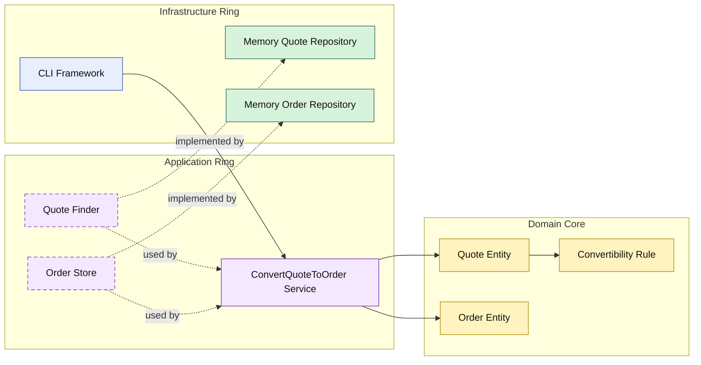

# Lesson 007: Convert Quote To Order

## Objective

Add the first cross-aggregate workflow by converting an approved quote into an order.

## Theory

The Onion track now has a meaningful quote lifecycle:

- draft
- pending approval
- approved

The next step is to use that approved quote as input for another domain concept.

This is a good Onion lesson because it shows a different kind of application service:

- it does not only load and mutate one aggregate
- it coordinates two repository contracts
- it creates a new domain object from an existing approved one

The domain core still owns the business rules:

- the quote decides whether it is convertible
- the order captures the business snapshot

The application ring owns the orchestration:

- load quote
- create order from quote
- save order

## Why This Matters Here

Without a cross-aggregate workflow, the Onion rings are still mostly demonstrating quote-local changes.

Conversion makes the architecture more realistic:

- one approved business document becomes another
- the application ring coordinates the handoff
- infrastructure still stays outside the business decision

## Diagram

Legend:

- blue: framework edge
- green: data adapter
- purple: application ring
- yellow: domain core
- dashed border: interface / contract
- dashed arrow: structural relationship

## Implementation Focus

Implement one workflow:

- convert approved quote to order

The code should show:

- an `Order` entity in the domain core
- a quote rule that only approved quotes can be converted
- an application service that loads the quote and saves the order
- an in-memory order repository
- a demo that reaches conversion after approval

## What To Verify

- `go test ./...` passes
- approved quotes can be converted
- non-approved quotes cannot be converted
- the order is created as a business snapshot from the quote
