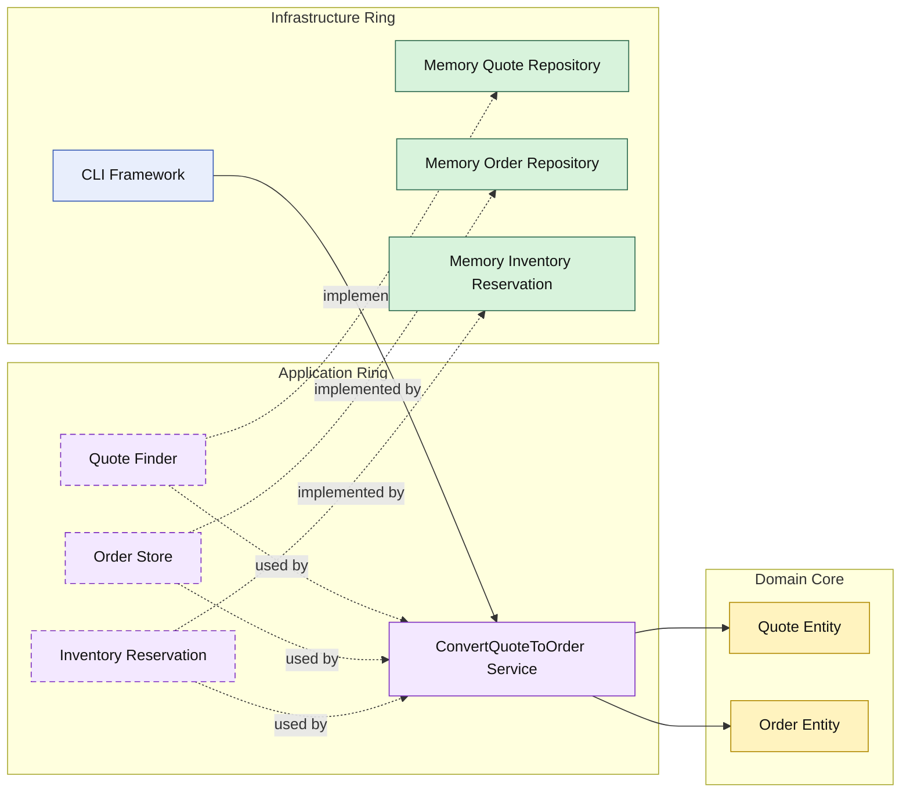

# Lesson 008: Order Conversion With Reservation

## Objective

Extend quote-to-order conversion so the application ring also reserves inventory before persisting the order.

## Theory

The previous lesson showed a cross-aggregate workflow:

- load approved quote
- create order
- save order

Real workflows often need one more thing:

- a side effect in an external operational subsystem

Onion Architecture handles that by keeping the domain unchanged and letting the application ring coordinate an additional inward-facing contract.

In this lesson:

- the domain still creates the order from the quote
- the application ring translates order lines into reservation items
- infrastructure provides the inventory implementation

This keeps the responsibility split clean:

- the domain decides what an order is
- the application ring decides which collaborators the workflow needs
- infrastructure performs the external stock operation

## Why This Matters Here

Without reservation, conversion is still only a document handoff.

Reservation makes the workflow operational:

- an order now claims stock
- failure in stock reservation blocks order creation
- the application ring coordinates both business and operational steps

That makes the Onion boundary around external services more visible.

## Diagram

Legend:

- blue: framework edge
- green: data adapter
- purple: application ring
- yellow: domain core
- dashed border: interface / contract
- dashed arrow: structural relationship

## Implementation Focus

Implement one operational extension:

- reserve inventory during quote-to-order conversion

The code should show:

- reservation item types in the domain layer
- an inventory reservation contract in the application ring
- an in-memory reservation adapter
- conversion failing when stock is insufficient

## What To Verify

- `go test ./...` passes
- approved quotes reserve stock when converted
- insufficient stock blocks conversion
- the order is only saved after successful reservation
