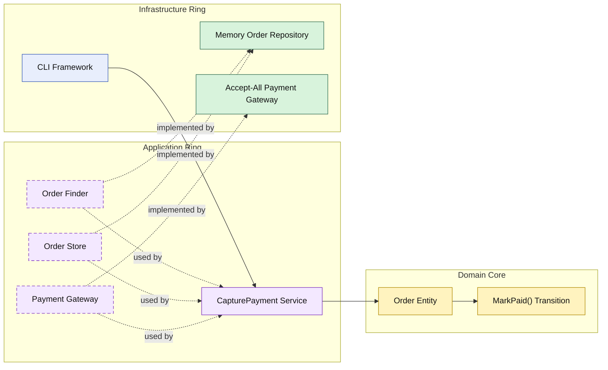

# Lesson 009: Payment Gateway And Order Capture

## Objective

Continue the order workflow by capturing payment through an external gateway before marking the order as paid.

## Theory

The Onion track now has an order created from an approved quote with inventory already reserved.

The next step is another external dependency:

- payment capture

This is a useful Onion lesson because it reinforces the same boundary rule with a different subsystem:

- the domain core owns the paid transition
- the application ring calls the payment contract
- infrastructure performs the external operation

The important distinction is:

- the payment gateway decides whether capture succeeds
- the `Order` entity decides what a valid paid state transition is

## Why This Matters Here

If the payment adapter marks the order as paid directly, it leaks business state into infrastructure.

If the application service changes the order status without calling the domain, the core becomes weaker again.

The Onion answer stays consistent:

- infrastructure reports payment success
- the application ring orchestrates
- the domain core applies the lifecycle rule

## Diagram

Legend:

- blue: framework edge
- green: data adapter
- purple: application ring
- yellow: domain core
- dashed border: interface / contract
- dashed arrow: structural relationship

## Implementation Focus

Implement one workflow step:

- capture payment for order

The code should show:

- an order paid transition in the domain core
- an application service that loads the order, calls payment, and saves the order
- an in-memory order query capability
- a simple payment gateway adapter

## What To Verify

- `go test ./...` passes
- pending-payment orders can be paid
- already paid orders cannot be paid again
- the domain core still owns the order state transition
