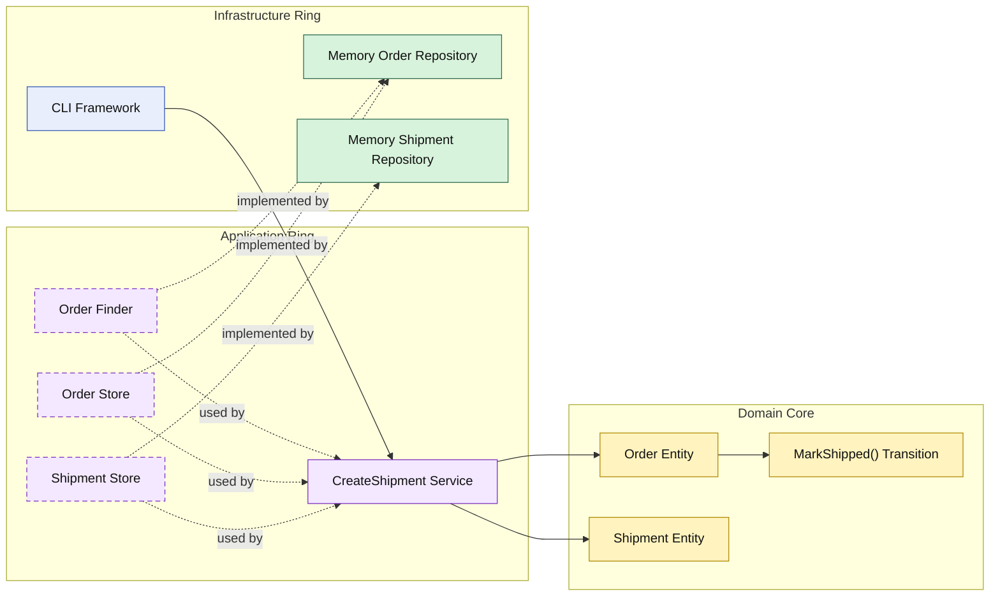

# Lesson 010: Shipment Creation After Payment

## Objective

Complete the first narrow fulfillment path by creating a shipment only after payment has been captured.

## Theory

The Onion track now reaches a paid order.

The next step is fulfillment:

- create a shipment
- mark the order as shipped

This is another useful Onion lesson because it adds a second aggregate around the order workflow while still keeping the responsibilities clean:

- the order owns whether shipment is allowed
- the shipment captures the fulfillment snapshot
- the application ring coordinates repository access

The shipment itself is not created by infrastructure.

It is created in the domain core and then persisted by infrastructure from the outside.

## Why This Matters Here

If shipment creation happens without a rule on the order, then fulfillment eligibility leaks out of the core.

If the application service mutates order state directly, the domain becomes weak again.

The Onion pattern stays the same:

- domain owns the lifecycle transition
- application orchestrates
- infrastructure stores the result

## Diagram

Legend:

- blue: framework edge
- green: data adapter
- purple: application ring
- yellow: domain core
- dashed border: interface / contract
- dashed arrow: structural relationship

## Implementation Focus

Implement one fulfillment workflow:

- create shipment for paid order

The code should show:

- shipment as a domain concept
- an order transition from `Paid` to `Shipped`
- an application service that creates and stores a shipment
- in-memory shipment storage

## What To Verify

- `go test ./...` passes
- paid orders can be shipped
- unpaid orders cannot be shipped
- the order and shipment are both persisted through the application ring
