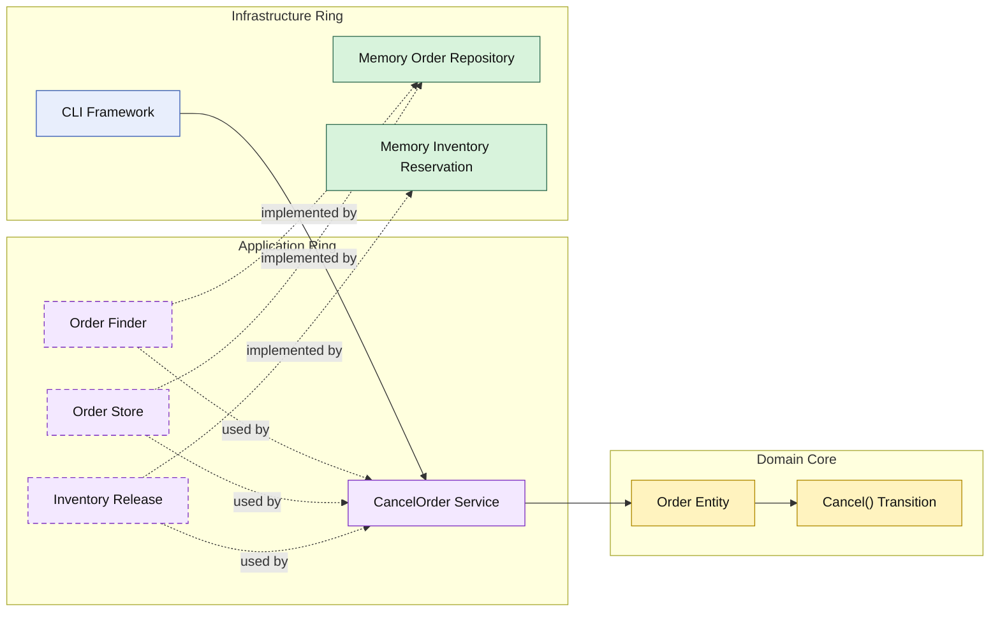

# Lesson 011: Order Cancellation And Release

## Objective

Add the first reverse order workflow by cancelling an unshipped order and releasing its reserved inventory.

## Theory

The Onion track now covers the forward path:

- convert quote to order
- capture payment
- create shipment

The next useful branch is the reverse path before shipment:

- cancel the order
- release reserved stock

This is a good Onion lesson because the workflow spans both business state and an external operational concern.

The split stays the same:

- the order owns whether cancellation is allowed
- the application ring coordinates stock release and persistence
- infrastructure performs the inventory operation

## Why This Matters Here

If cancellation only changes order status without releasing stock, the workflow is incomplete.

If the inventory adapter decides whether the order is cancellable, business rules leak outside the core.

The Onion answer is:

- the domain core decides if cancellation is valid
- the application ring translates order lines into release items
- infrastructure releases the stock

## Diagram

Legend:

- blue: framework edge
- green: data adapter
- purple: application ring
- yellow: domain core
- dashed border: interface / contract
- dashed arrow: structural relationship

## Implementation Focus

Implement one reverse workflow:

- cancel order before shipment

The code should show:

- an order cancellation rule in the domain core
- an inventory release contract in the application ring
- in-memory release support in the inventory adapter
- cancellation blocked once the order is shipped

## What To Verify

- `go test ./...` passes
- unshipped orders can be cancelled
- cancelling an order releases reserved stock
- shipped orders cannot be cancelled
