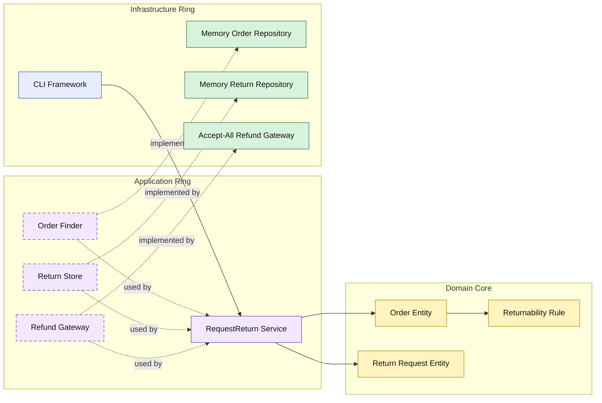

# Lesson 012: Return Request And Refund Boundary

## Objective

Add the first post-shipment reverse workflow by separating returns from cancellation and introducing a refund gateway boundary.

## Theory

Cancellation and returns are not the same workflow.

Cancellation happens before fulfillment is complete.

Returns happen after shipment and usually require a different boundary:

- the order decides whether return is allowed
- the application ring coordinates refund execution
- infrastructure performs the external refund operation

This is important in Onion Architecture because it keeps the reverse workflow honest:

- the domain core owns returnability
- the application ring owns orchestration
- infrastructure remains an implementation detail

## Why This Matters Here

If returns are modeled as just another cancel operation, the core loses an important business distinction.

Adding a separate return workflow makes the lifecycle clearer:

- shipped orders can request returns
- non-shipped orders cannot
- refund execution happens through an external service boundary

## Diagram

Legend:

- blue: framework edge
- green: data adapter
- purple: application ring
- yellow: domain core
- dashed border: interface / contract
- dashed arrow: structural relationship

## Implementation Focus

Implement one reverse workflow:

- request return for shipped order

The code should show:

- return request as a separate domain concept
- a returnability rule on the order
- a refund gateway contract in the application ring
- in-memory return storage and a simple refund adapter

## What To Verify

- `go test ./...` passes
- shipped orders can create return requests
- non-shipped orders cannot create return requests
- refund execution stays outside the domain core
