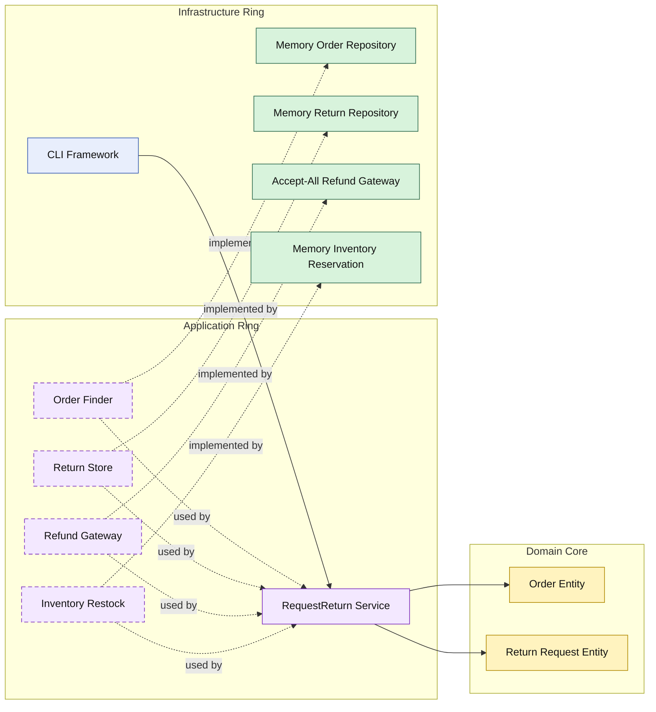

# Lesson 013: Return Restocking Boundary

## Objective

Complete the stock-side reversal after returns by restocking inventory as part of the return workflow.

## Theory

The previous lesson added the first post-shipment reverse path:

- shipped order can request a return
- refund is executed through an external gateway

That still leaves one missing operational concern:

- returned stock should go back into inventory

Onion Architecture handles this the same way it handles reservation and release:

- the application ring owns the workflow coordination
- the domain core stays focused on business concepts
- infrastructure implements the stock operation

The important separation is:

- refund is a money-side boundary
- restock is an inventory-side boundary

They belong to the same workflow, but they are not the same dependency.

## Why This Matters Here

If returns stop at refund, the reverse workflow is only financially complete.

Adding restocking makes it operationally complete as well:

- refund compensates the customer
- restock compensates inventory

This makes the Onion application ring more realistic because it now coordinates multiple external boundaries in the same use case.

## Diagram

Legend:

- blue: framework edge
- green: data adapter
- purple: application ring
- yellow: domain core
- dashed border: interface / contract
- dashed arrow: structural relationship

## Implementation Focus

Implement one stock-side extension:

- restock inventory during return request processing

The code should show:

- a distinct restock item type
- an inventory restock contract in the application ring
- in-memory restock support in the inventory adapter
- tests proving stock rises after a refunded return

## What To Verify

- `go test ./...` passes
- shipped orders still produce refunded return requests
- return processing restocks inventory
- restocking stays outside the domain core
