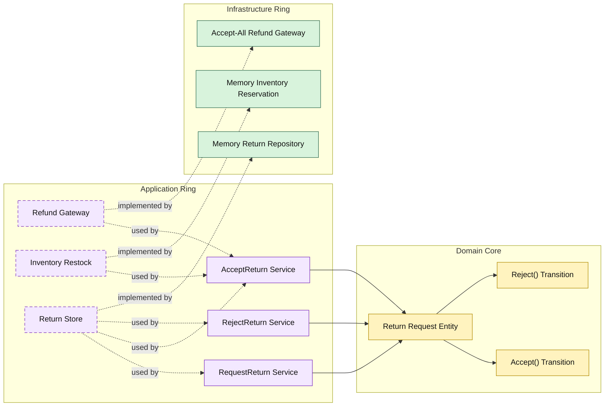

# Lesson 014: Return Review Boundary

## Objective

Insert an explicit review step into the return workflow so refund and restock happen only after acceptance.

## Theory

The previous lessons introduced returns as a post-shipment reverse workflow and then completed the stock-side reversal.

That still leaves one simplifying assumption:

- every return request is refunded immediately

Real workflows often need a review boundary first.

Onion Architecture handles that by keeping the return state machine in the domain core while moving the external side effects to a later application service.

In this lesson:

- requesting a return only creates a `Requested` return
- accepting a return performs refund and restock
- rejecting a return closes the request without side effects

## Why This Matters Here

Without a review boundary, return status is mostly an audit trail after the fact.

Adding explicit review makes the lifecycle meaningful:

- request
- accept or reject
- refund and restock only on acceptance

That gives the domain core another real state transition and makes the application workflow more realistic.

## Diagram

## Implementation Focus

Implement one workflow refinement:

- add explicit accept and reject steps for returns

The code should show:

- return request states in the domain core
- request service creating only `Requested`
- accept service performing refund and restock
- reject service persisting a rejected request without side effects

## What To Verify

- `go test ./...` passes
- requested returns can be accepted and then refunded/restocked
- requested returns can be rejected
- rejected returns do not refund or restock
