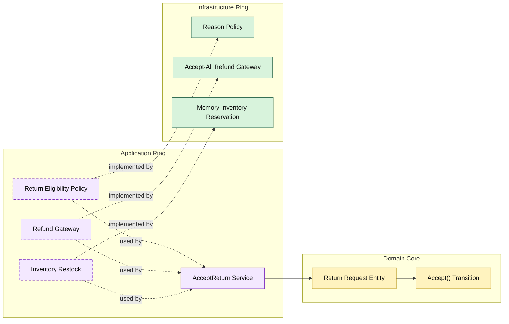

# Lesson 015: Return Eligibility Policy

## Objective

Make return acceptance policy-aware so not every requested return is accepted automatically.

## Theory

The previous lesson added a review boundary:

- request
- accept or reject
- refund and restock only on acceptance

That still leaves one simplifying assumption:

- every requested return is acceptable

Onion Architecture handles that by adding another inward-facing policy contract owned by the application ring.

This keeps the responsibilities clear:

- the domain core owns the return state machine
- the application ring asks whether the request is eligible
- infrastructure provides the concrete policy implementation

## Why This Matters Here

If acceptance is unconditional, the review boundary is only procedural.

Adding an eligibility policy makes the review decision substantive:

- some returns are accepted
- some returns are refused by policy

This is exactly the kind of rule that often changes independently from core lifecycle rules, which makes it a strong candidate for an application-owned boundary.

## Diagram

## Implementation Focus

Implement one rule refinement:

- acceptance depends on a return eligibility policy

The code should show:

- a policy contract in the application ring
- a simple reason-based policy in infrastructure
- acceptance blocked before refund and restock when policy rejects the request

## What To Verify

- `go test ./...` passes
- eligible requested returns can still be accepted
- policy-blocked returns stay in `Requested`
- blocked returns do not refund or restock
