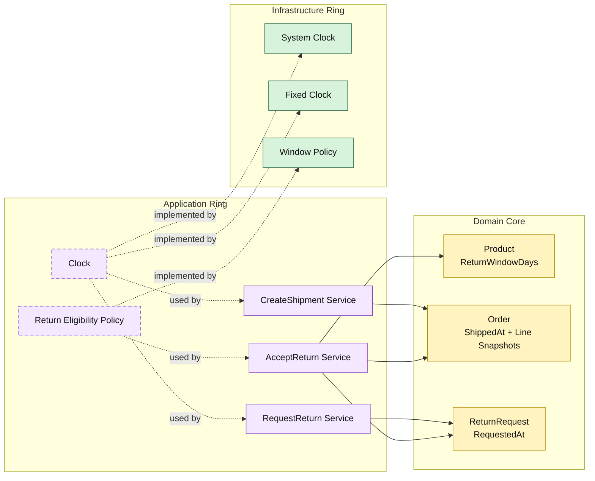

# Lesson 016: Real Return Window Policy

## Objective

Replace the placeholder return-eligibility rule with a real time-based return window.

## Theory

The previous lesson introduced a return-eligibility policy boundary, but the rule itself was still only a placeholder.

This lesson makes that boundary real by introducing business time facts:

- products carry a return window
- orders snapshot that return window
- shipment records when the order shipped
- return requests record when the request was made

The policy can then decide eligibility from those facts instead of from a hard-coded reason string.

## Why This Matters Here

This is one of the clearest examples of why Onion Architecture keeps technical dependencies outside.

Time matters to the business rule, but the domain core should not call `time.Now()` directly.

Instead:

- the application ring owns a clock contract
- infrastructure provides the actual time source
- the domain stores the relevant timestamps as business facts

## Diagram

Legend:

- green: infrastructure adapter
- purple: application ring
- yellow: domain core
- dashed border: interface / contract
- dashed arrow: structural relationship

## Implementation Focus

Implement one policy upgrade:

- real time-based return eligibility

The code should show:

- return-window days on products and order lines
- shipped time on orders
- requested time on return requests
- a clock contract plus system/fixed implementations
- a real window policy adapter

## What To Verify

- `go test ./...` passes
- in-window returns can be accepted
- out-of-window returns stay requested
- time handling stays outside the domain core
