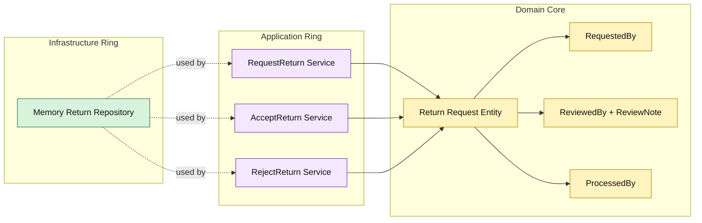

# Lesson 017: Return Actor Metadata

## Objective

Make the return workflow auditable by carrying actor identity through request, review, and refund processing.

## Theory

The return workflow now has:

- request
- review
- policy evaluation
- refund
- restock

But it still lacks one important business fact:

- who performed each step

Onion Architecture handles that by keeping the audit fields in the domain core and requiring the application ring to supply them when transitions occur.

That means:

- request creation records who requested it
- acceptance or rejection records who reviewed it
- refund completion records who processed it

## Why This Matters Here

Without actor data, the workflow is technically correct but operationally weak.

Auditability is often part of the business requirement, not just an infrastructure concern.

Storing the actors in the return aggregate keeps the workflow explicit and makes review decisions inspectable without leaking the logic into adapters.

## Diagram

Legend:

- green: infrastructure adapter
- purple: application ring
- yellow: domain core

## Implementation Focus

Implement one auditability refinement:

- record actors through the return lifecycle

The code should show:

- actor fields on the return aggregate
- validation that actor information is required
- request/accept/reject commands carrying those values

## What To Verify

- `go test ./...` passes
- request, review, and refund processing store actor identities
- missing actor information is rejected
