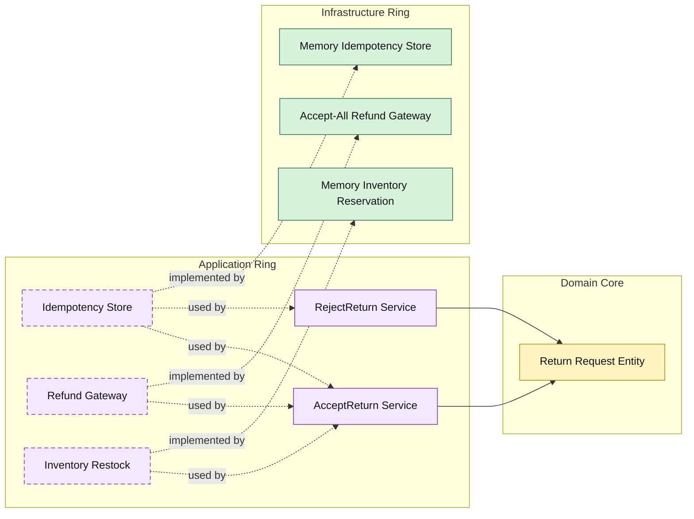

# Lesson 018: Return Command Idempotency

## Objective

Make return review commands safe to retry without replaying refund or restock side effects.

## Theory

The return workflow now has real branching, policy, time, and actor metadata.

That increases one operational risk:

- the same accept or reject command may be retried by a caller

If retries run the full workflow again, the system can refund twice or restock twice.

Onion Architecture handles that by adding another application-owned contract:

- the application ring owns an idempotency store
- infrastructure provides the storage implementation
- the domain core remains unchanged

This is the right boundary because idempotency is workflow protection, not a domain invariant on the return aggregate itself.

## Why This Matters Here

Without idempotency, the return review workflow is correct only under ideal delivery conditions.

Adding an idempotency boundary makes the workflow safer under retries:

- the first successful command records the result
- a duplicate command returns that result
- refund and restock do not happen twice

## Diagram

## Implementation Focus

Implement one retry-safety refinement:

- idempotent accept and reject return commands

The code should show:

- idempotency keys on review commands
- an application-owned idempotency store contract
- an in-memory idempotency store
- tests proving duplicate retries do not replay side effects

## What To Verify

- `go test ./...` passes
- duplicate accept commands do not refund or restock twice
- duplicate reject commands return the same result
- idempotency stays outside the domain core
