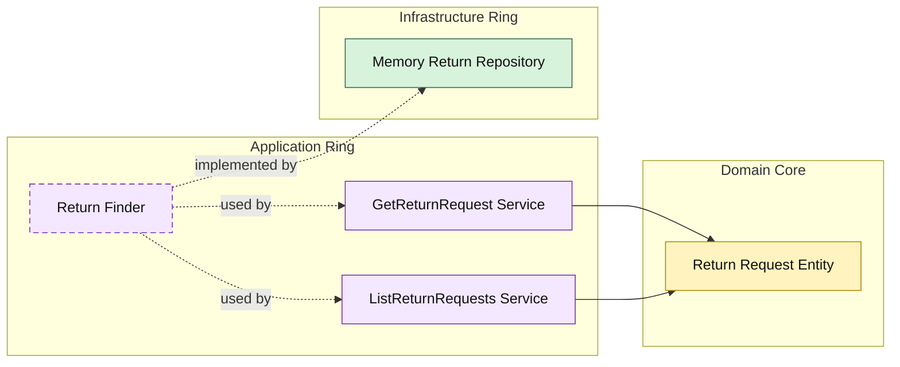

# Lesson 019: Return Query Surface

## Objective

Add an explicit read surface for return requests instead of leaving read access implicit in the repository adapter.

## Theory

The Onion track now has a fairly complete write-side return workflow:

- request
- review
- policy evaluation
- refund and restock
- idempotent review commands

The next step is to expose return reads through the application ring as well.

That matters because Onion Architecture should not only protect writes.

Reads should also flow through application-owned use cases so the outer layers do not learn the repository internals directly.

## Why This Matters Here

If a CLI or future HTTP adapter reads the memory repository directly, the return workflow stops demonstrating Onion boundaries on the query side.

Adding explicit query services keeps the same rule intact:

- application owns the read use case
- infrastructure only implements storage
- outer layers depend on application, not on repository details

## Diagram

## Implementation Focus

Implement two read use cases:

- get return request by id
- list return requests by status

The code should show:

- a return finder contract in the application ring
- query result models shaped by the application
- in-memory support for listing by status

## What To Verify

- `go test ./...` passes
- single return requests can be loaded by id
- return requests can be filtered by status
- reads still flow through the application ring
