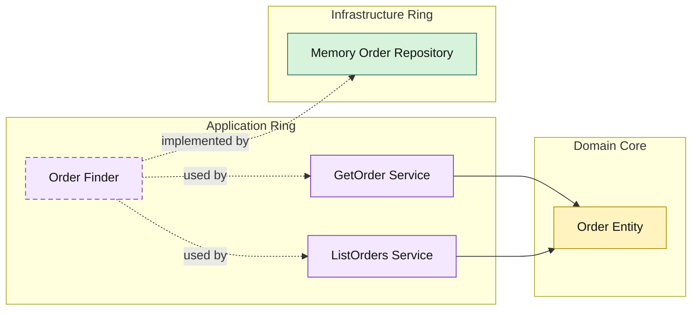

# Lesson 020: Order Query Surface

## Objective

Add an explicit read surface for orders so the main fulfillment aggregate has the same application-owned query boundary as returns.

## Theory

The Onion track now has a meaningful order lifecycle:

- conversion
- reservation
- payment
- shipment
- cancellation

That makes order reads important enough to deserve first-class application use cases instead of ad hoc repository access.

As with other Onion query lessons:

- the application ring owns the read use cases
- infrastructure only implements storage lookup
- outer layers depend on the application surface, not on repository details

## Why This Matters Here

If callers read the order repository directly, the fulfillment workflow loses one of the main architectural lessons of the repo:

- reads should cross the same ring boundary intentionally

This lesson keeps that consistent by making order queries explicit and by letting the application ring shape the returned data.

## Diagram

## Implementation Focus

Implement two read use cases:

- get order by id
- list orders by status

The code should show:

- an order finder contract in the application ring
- query result models shaped by the application
- in-memory support for filtering by status

## What To Verify

- `go test ./...` passes
- single orders can be loaded by id
- orders can be filtered by status
- reads still flow through the application ring
