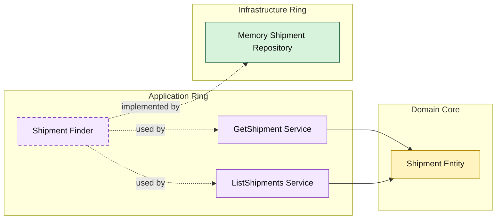

# Lesson 021: Shipment Query Surface

## Objective

Add an explicit read surface for shipments so fulfillment reads follow the same Onion query pattern as quotes, returns, and orders.

## Theory

The Onion track now has an end-to-end fulfillment write path:

- order conversion
- payment
- shipment creation

At this point, shipment reads deserve the same treatment as the other workflow objects.

That means:

- the application ring owns the shipment query use cases
- infrastructure only implements lookup and filtering
- outer layers read through the application surface, not directly through the repository

## Why This Matters Here

Without shipment queries, the fulfillment side is still uneven:

- writes are explicit through the application ring
- reads are still implicit in the storage adapter

This lesson makes the shipment side consistent with the rest of the track.

## Diagram

## Implementation Focus

Implement two read use cases:

- get shipment by id
- list shipments by order id

The code should show:

- a shipment finder contract in the application ring
- query result models shaped by the application
- in-memory support for shipment lookup and filtering

## What To Verify

- `go test ./...` passes
- single shipments can be loaded by id
- shipments can be filtered by order id
- reads still flow through the application ring
