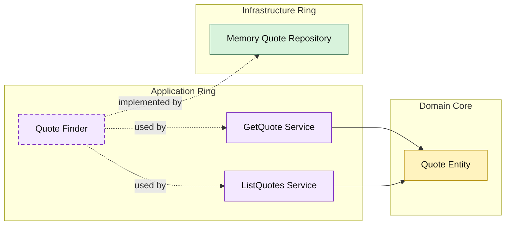

# Lesson 022: Quote List Query Surface

## Objective

Round out the quote read side by adding list-by-status support through the application ring.

## Theory

The Onion track already has:

- single quote lookup
- order queries
- shipment queries
- return queries

Quotes are the last main workflow object that still only has the single-item read use case.

This lesson makes the query side consistent:

- the application ring owns the list use case
- infrastructure only implements filtering
- outer layers depend on the application query surface

## Why This Matters Here

Without quote listing, the track still leaves one common read path unfinished:

- "show me all quotes in a given lifecycle state"

That is a useful read for approval workflows in particular, and it reinforces that list queries also belong in the application ring.

## Diagram

## Implementation Focus

Implement one additional read use case:

- list quotes by status

The code should show:

- a richer quote finder contract
- quote list results shaped in the application ring
- in-memory support for status filtering

## What To Verify

- `go test ./...` passes
- quotes can be filtered by status
- the quote query surface now matches the main workflow objects
