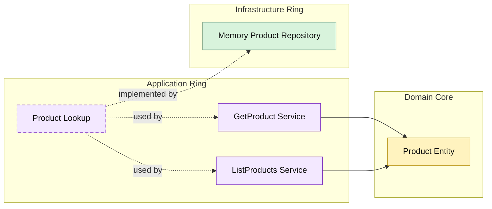

# Lesson 023: Product Query Surface

## Objective

Add an explicit product read surface through the application ring so catalog queries follow the same Onion pattern as the main workflow objects.

## Theory

Products started in the Onion track as a supporting dependency for quote-line and policy workflows.

At this point, they also deserve explicit query use cases in their own right.

That keeps the read-side rule consistent:

- the application ring owns the query surface
- infrastructure only implements lookup and filtering
- outer layers do not learn storage details directly

## Why This Matters Here

Product queries are often used by:

- quote building
- catalog browsing
- policy inspection

If those reads bypass the application ring, the catalog stays architecturally weaker than the rest of the system.

This lesson fixes that by making product reads first-class application use cases.

## Diagram

## Implementation Focus

Implement two read use cases:

- get product by sku
- list products by category and availability

The code should show:

- a product lookup contract in the application ring
- application-shaped product query results
- in-memory filtering by category and active status

## What To Verify

- `go test ./...` passes
- products can be loaded by sku
- products can be filtered by category and availability
- product reads now cross the application ring explicitly
