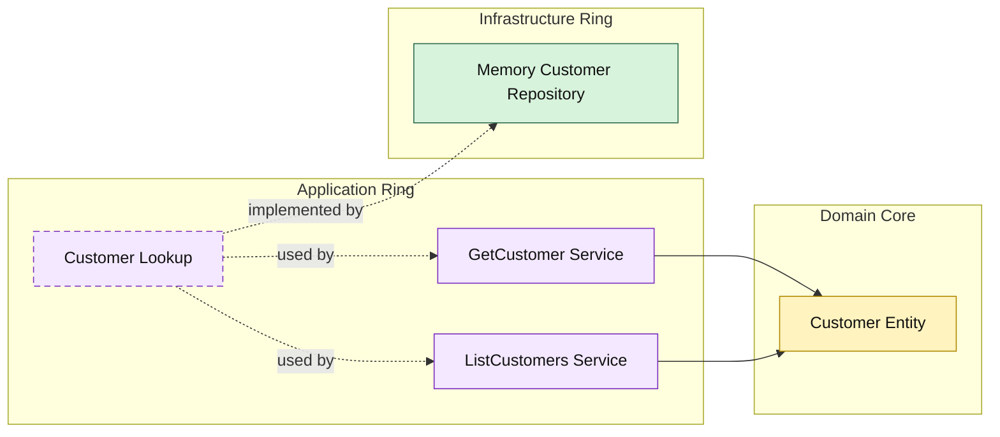

# Lesson 024: Customer Query Surface

## Objective

Add an explicit customer read surface through the application ring so the main supporting entities now all have first-class query use cases.

## Theory

Customers have been present since the first Onion lesson, but only as a supporting dependency for quote creation.

At this point, they should be queryable through the same architectural path as products, quotes, orders, returns, and shipments.

That keeps the repository consistent:

- application ring owns the query use cases
- infrastructure only implements lookup and filtering
- outer layers depend on application, not directly on storage

## Why This Matters Here

Customer reads often support:

- quote creation
- order review
- support workflows

If they bypass the application ring, one of the core teaching points of the repo becomes inconsistent on a basic entity.

## Diagram

## Implementation Focus

Implement two read use cases:

- get customer by id
- list customers by active status

The code should show:

- a customer lookup contract in the application ring
- application-shaped customer query results
- in-memory filtering by active status

## What To Verify

- `go test ./...` passes
- customers can be loaded by id
- customers can be filtered by active status
- customer reads now cross the application ring explicitly
