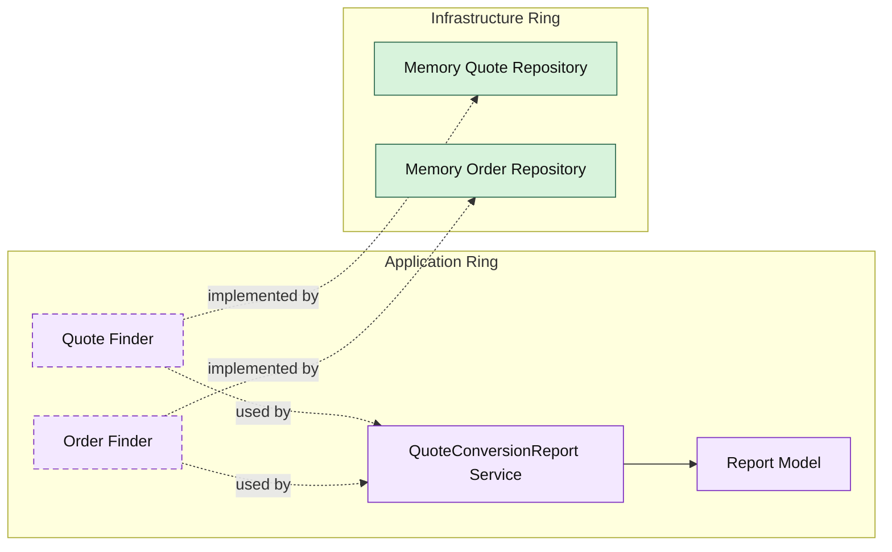

# Lesson 025: Quote Conversion Report

## Objective

Introduce the first projection-style report in the Onion track by computing quote conversion metrics from existing quote and order reads.

## Theory

The query lessons so far have focused on retrieving one aggregate or listing aggregates by a simple filter.

A report is different.

It is not just one aggregate lookup.

It is a projection assembled from multiple sources to answer a business question.

In Onion Architecture, that still belongs in the application ring:

- the application ring coordinates the inputs
- the report model is shaped there
- infrastructure only provides the raw reads

## Why This Matters Here

This is the first place where the Onion read side starts to feel like reporting instead of entity retrieval.

The question is no longer:

- "what is this quote?"

It becomes:

- "how many approved quotes were converted?"

That makes it a good lesson for showing that application services can assemble cross-aggregate read models without pushing reporting logic into repositories.

## Diagram

## Implementation Focus

Implement one projection-style read use case:

- quote conversion report

The code should show:

- a report model in the application ring
- cross-repository read composition
- no new domain entities for reporting

## What To Verify

- `go test ./...` passes
- the report counts total, approved, and converted quotes
- the conversion rate is computed in the application ring
