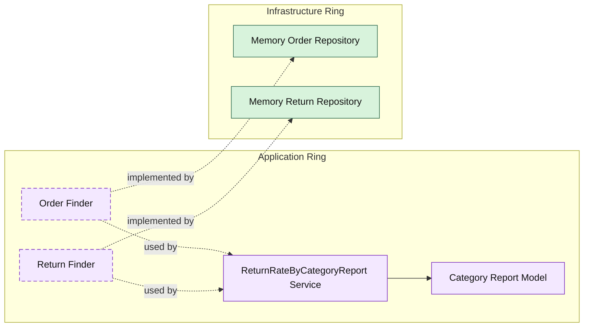

# Lesson 026: Return Rate By Category Report

## Objective

Add a second projection-style report that computes shipped and returned quantities per product category.

## Theory

The first Onion report aggregated quote and order state into a business metric.

This lesson does the same for the return workflow:

- shipped orders provide shipped quantity
- refunded returns provide returned quantity
- category snapshots on order lines make the projection possible without looking outside the aggregate snapshots

As with the previous report, this belongs in the application ring because it is a projection assembled from existing reads rather than a domain entity of its own.

## Why This Matters Here

The return workflow is now rich enough that category-level analysis becomes meaningful.

This report shows another benefit of keeping snapshots in the core:

- the report can be computed from business records
- no extra infrastructure-only join logic is required

It also demonstrates that the application ring can compose multiple aggregate reads into a reporting shape without changing the domain model.

## Diagram

## Implementation Focus

Implement one projection-style read use case:

- return rate by category

The code should show:

- cross-aggregate read composition in the application ring
- grouping by category from order line snapshots
- returned quantity coming only from refunded returns

## What To Verify

- `go test ./...` passes
- the report counts shipped and returned quantities by category
- the return rate is computed from those quantities
