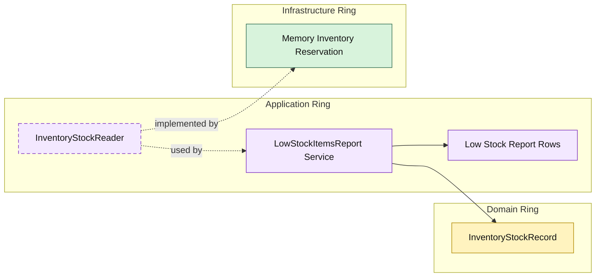

# Lesson 027: Low Stock Items Report

## Objective

Add an operational inventory report that introduces a narrow stock read boundary in the application ring.

## Theory

So far, inventory in the Onion track has only appeared as command-side behavior:

- reserve stock
- release stock
- restock returned items

That is enough for workflows, but not enough for operational visibility.

This lesson introduces a small read seam:

- infrastructure can expose stock snapshots
- the application ring decides what counts as low stock
- the report stays an application concern rather than an infrastructure query shortcut

This matters because the threshold rule is business-facing. The memory adapter should not decide what "low" means.

## Why This Matters Here

The Onion model is already showing:

- domain rules in the core
- workflow orchestration in the application ring
- storage and gateways in infrastructure

This lesson adds one more useful distinction:

- infrastructure provides raw stock state
- application turns that state into a report

That keeps the reporting rule close to the use case instead of burying it inside the repository.

## Diagram

Legend:

- yellow: domain type
- purple: application type
- green: infrastructure data adapter
- dashed border: contract
- dashed arrow: structural relationship such as `used by` or `implemented by`

## Implementation Focus

Add:

- a stock snapshot record in the domain ring
- an application-owned stock reader contract
- a low stock report service that filters by threshold

The infrastructure adapter should only return current stock snapshots.

## What To Verify

- `go test ./...` passes
- items at or below the requested threshold are included
- the demo can print the low-stock report
