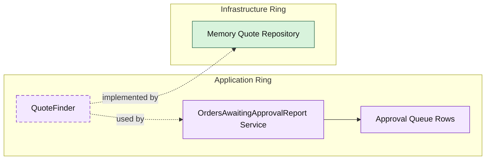

# Lesson 028: Orders Awaiting Approval Report

## Objective

Add an approval-queue style report that exposes pending approval work as an application-owned projection.

## Theory

The name "orders awaiting approval" is slightly imperfect in this Onion track.

The current model does not have:

- a separate approval aggregate
- an order that exists before quote approval

What it does have is:

- quotes in `PendingApproval`

So the honest projection is:

- an approval queue over pending-approval quotes

This is still a useful Onion lesson because it shows that application reports do not need to mirror aggregate names mechanically. The application ring can speak in the language of operational work while still being explicit about the underlying model it reads.

## Why This Matters Here

The Onion reporting track already includes:

- business metrics
- return analysis
- operational stock visibility

This lesson adds a human workflow queue.

That is a different kind of read model:

- not a raw entity list
- not a purely aggregated metric
- not an infrastructure snapshot

It broadens the reporting story without inventing domain structures the current model does not actually own.

## Diagram

Legend:

- purple: application type
- green: infrastructure data adapter
- dashed border: contract
- dashed arrow: structural relationship such as `used by` or `implemented by`

## Implementation Focus

Add:

- `OrdersAwaitingApprovalReport`

The code should show:

- a queue-style projection over `PendingApproval` quotes
- total amount calculation inside the application service
- line count and customer context included in the queue row

## What To Verify

- `go test ./...` passes
- pending approval quotes appear in the queue
- line counts and total amounts are calculated correctly
