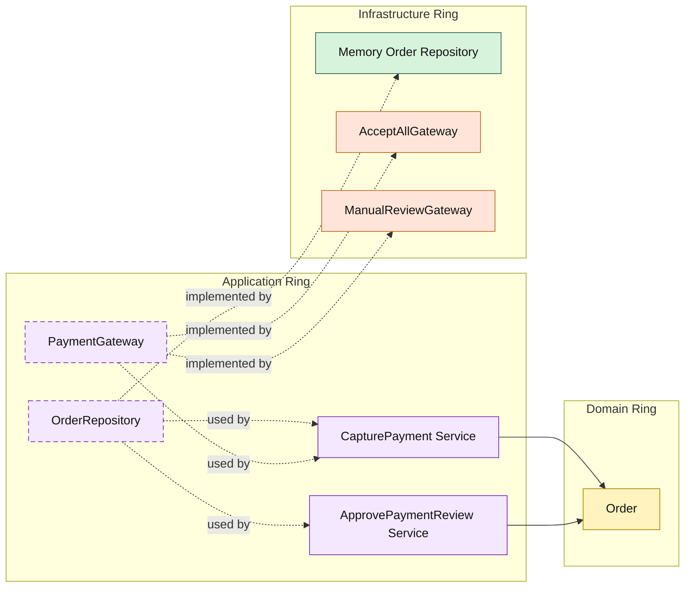

# Lesson 029: Payment Review Workflow

## Objective

Introduce a payment review state so payment capture can produce a business outcome other than immediate success.

## Theory

Until now, payment capture in the Onion track has been modeled as:

- success, or
- technical failure

That is too narrow for many real payment integrations.

A gateway may report:

- approve immediately
- send to manual review
- fail technically

The important point is that manual review is not just an error. It is a business outcome that changes workflow state.

In Onion Architecture, that means:

- the application ring owns the capture outcome contract
- the domain ring owns the `PaymentReview -> Paid` state rule
- infrastructure only reports the external capture outcome

## Why This Matters Here

This adds a real branch to the order lifecycle:

- `PendingPayment`
- `PaymentReview`
- `Paid`
- `Shipped`

That makes the Onion workflow more realistic and shows how application services translate external outcomes into domain state transitions without pushing gateway semantics into the domain model itself.

## Diagram

Legend:

- yellow: domain type
- purple: application type
- green: infrastructure data adapter
- orange: infrastructure behavior adapter
- dashed border: contract
- dashed arrow: structural relationship such as `used by` or `implemented by`

## Implementation Focus

Add:

- `PaymentReview` as an order state
- payment capture outcomes for approved vs review
- `ApprovePaymentReview`

The code should show:

- the gateway returning a business outcome instead of only `error`
- capture moving some orders into `PaymentReview`
- shipment remaining blocked until review is approved

## What To Verify

- `go test ./...` passes
- capture can move an order to `PaymentReview`
- approving payment review moves the order to `Paid`
- shipment is rejected while the order is still in review
