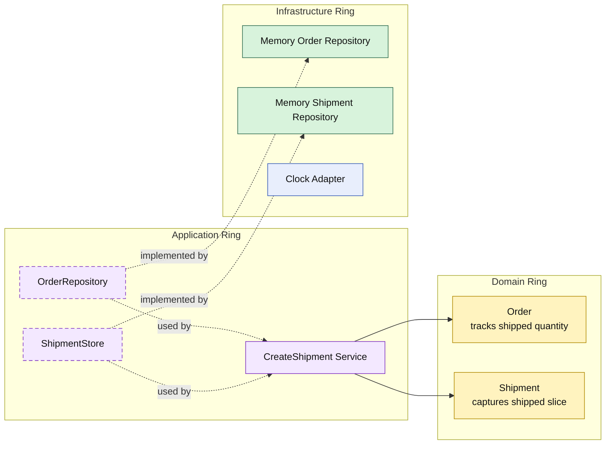

# Lesson 030: Partial Shipment Support

## Objective

Make fulfillment quantity-aware so an order can be shipped in multiple steps instead of only as an all-or-nothing transition.

## Theory

Up to this point, shipment creation has assumed a simple rule:

- once an order is payable, one shipment ships everything

That is useful early on, but too narrow for a realistic fulfillment workflow.

Real systems often need:

- a first shipment for available quantity
- later shipments for the remaining quantity

In the Onion model, the core should own that fulfillment truth:

- the domain ring tracks shipped quantity per order line
- the domain ring resolves which quantities are still shippable
- the application ring decides whether the command ships explicit quantities or all remaining quantities

The important lifecycle change is the new intermediate state:

- `PartiallyShipped`

## Why This Matters Here

The payment review lesson added a branch before fulfillment.

This lesson adds incremental fulfillment inside fulfillment itself.

The shipping workflow is no longer a one-time state flip. It becomes progress over time, and that affects other application services too:

- cancellation must now reject partially shipped orders
- later shipment commands must continue from remaining quantity
- conversion reports should still count partial fulfillment as converted workflow progress

## Diagram

Legend:

- yellow: domain type
- purple: application type
- green: infrastructure data adapter
- blue: framework/runtime helper
- dashed border: contract
- dashed arrow: structural relationship such as `used by` or `implemented by`

## Implementation Focus

Add:

- `PartiallyShipped` order state
- shipped quantity tracking on order lines
- explicit shipment line input for partial shipment
- default "ship all remaining" behavior for the existing full-shipment path

The code should show:

- the domain updating shipment progress
- later shipments continuing from remaining quantity
- cancellation treating partial shipment as already fulfilled

## What To Verify

- `go test ./...` passes
- a partial shipment stores only the requested quantity
- a later shipment can ship the remaining quantity
- partially shipped orders cannot be cancelled
