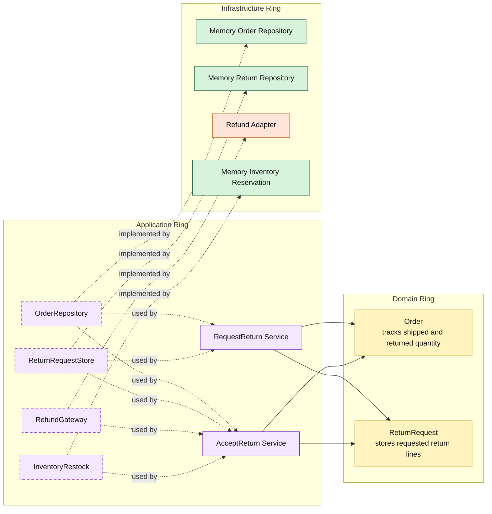

# Lesson 031: Partial Returns By Line

## Objective

Make returns quantity-aware so a return request can cover only some shipped units instead of always implying the whole order.

## Theory

Partial shipment support created an asymmetry:

- fulfillment can now happen in slices
- returns still behave like the whole shipped quantity comes back together

That is too coarse.

A realistic reverse flow often needs:

- return 1 of 2 shipped units
- return one SKU but not another
- make another return later for the remaining shipped quantity

In the Onion model, the domain ring should own those quantity rules:

- the order tracks shipped quantity and returned quantity
- the order resolves what quantity is still returnable
- the return request snapshots only the requested lines

The application ring then orchestrates review, refund, and restock from those domain-level quantities.

## Why This Matters Here

This is the natural counterpart to partial shipment.

Without it, the forward flow becomes more realistic while the reverse flow stays artificially simple.

This lesson brings the two halves back into alignment and makes the order entity carry more lifecycle truth around what has shipped versus what has already been returned.

## Diagram

Legend:

- yellow: domain type
- purple: application type
- green: infrastructure data adapter
- orange: infrastructure behavior adapter
- dashed border: contract
- dashed arrow: structural relationship such as `used by` or `implemented by`

## Implementation Focus

Add:

- explicit return line input
- return request line snapshots
- returned quantity tracking on order lines
- restock and return accounting based only on the accepted return lines

The code should show:

- requesting only some shipped quantity
- accepting a partial return updates order return progress
- later returns cannot exceed what has already shipped minus what was already returned

## What To Verify

- `go test ./...` passes
- a partial return request stores only the requested line quantities
- accepting a partial return restocks only those quantities
- returned quantity on the order increases correctly
