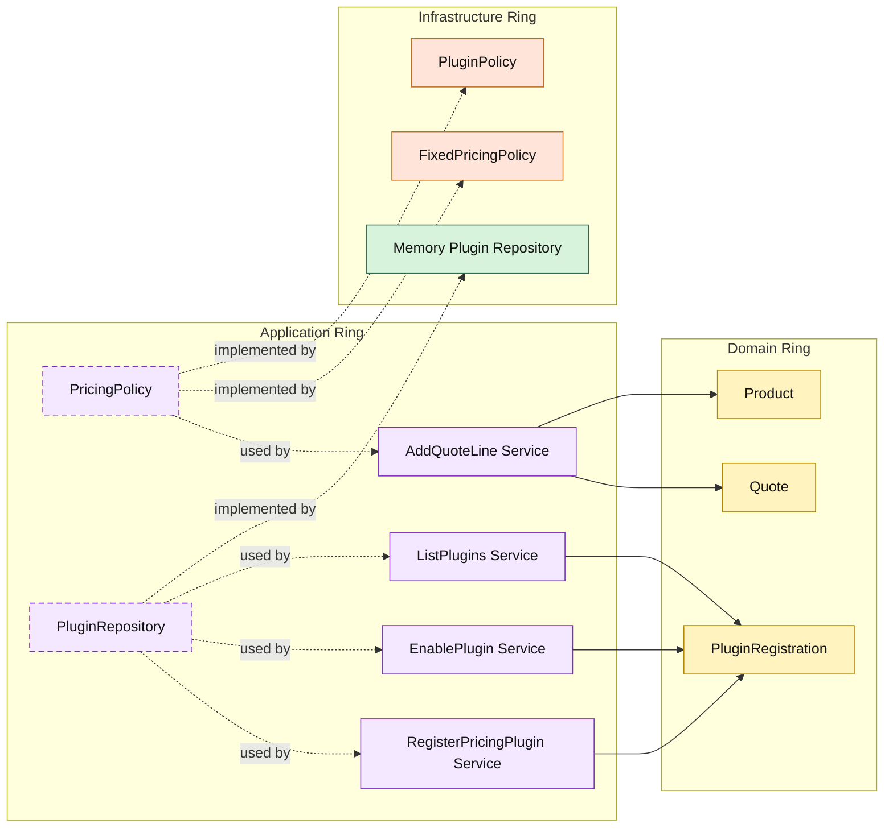

# Lesson 032: Plugin Pricing Extension Point

## Objective

Add a real extension seam so enabled plugins can change pricing without changing the quote use case or the domain model structure.

## Theory

Up to now, pricing in the Onion track has just been the product's stored unit price.

That proves a simple domain workflow, but not extensibility.

A plugin architecture introduces a different idea:

- the application ring keeps the pricing contract stable
- plugin registrations are managed separately
- infrastructure composes enabled pricing behavior behind the same pricing seam

This lesson keeps the extension deliberately narrow:

- quote line pricing

The quote workflow stays stable, but the effective unit price can change because the enabled plugin set changes.

## Why This Matters Here

Onion Architecture is not only about dependency direction. It is also about preserving a stable core while optional behavior grows around it.

Without this seam, every pricing experiment would push conditionals into:

- `AddQuoteLine`
- `Quote`
- or framework-specific service code

With it, the application service still orchestrates quote editing, the domain still owns quote state, and infrastructure can compose enabled pricing plugins without rewriting the core use case.

## Diagram

Legend:

- yellow: domain type
- purple: application type
- green: infrastructure data adapter
- orange: infrastructure behavior adapter
- dashed border: contract
- dashed arrow: structural relationship such as `used by` or `implemented by`

## Implementation Focus

Add:

- plugin registration, enable, and list services
- a plugin repository
- a pricing contract for `AddQuoteLine`
- a plugin-aware pricing adapter with one sample plugin: `seasonal-pricing`

The code should show:

- the quote use case stays stable
- pricing changes only because the enabled plugin set changes
- plugin registration and activation are application behavior, not framework magic

## What To Verify

- `go test ./...` passes
- a pricing plugin can be registered and enabled
- enabling `seasonal-pricing` changes the quote line unit price
