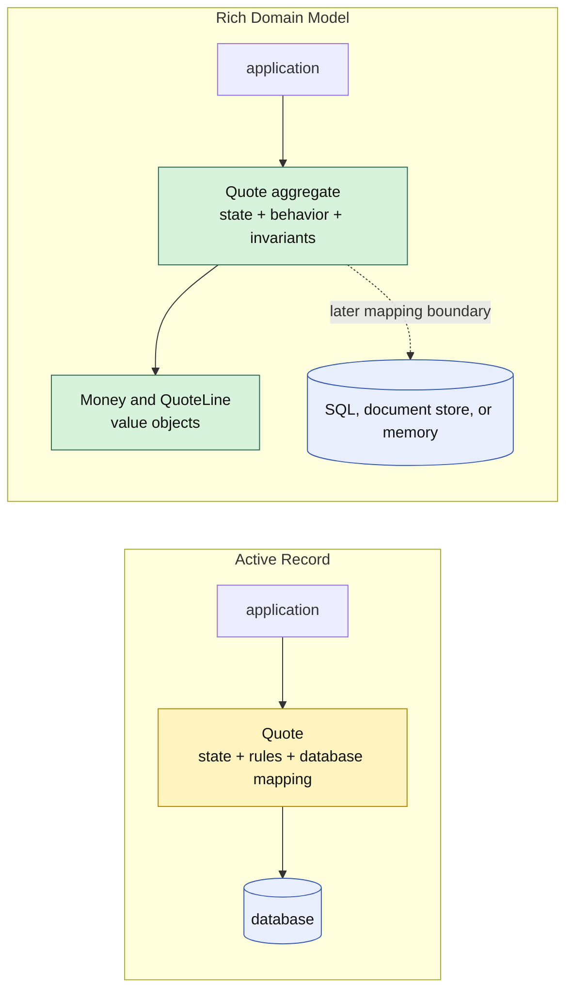

# Lesson 000: From Active Record To Rich Domain Model

## Objective

Explain the shift from a persistence-aware Active Record to a domain model whose objects own business behavior and invariants.

## Theory

Active Record combines a row's data with the operations needed to load and save that row. A `Quote` Active Record therefore knows about its database connection, its stored fields, and some of the workflow rules applied to those fields.

A Rich Domain Model moves the boundary. Domain objects are responsible for business meaning:

- the aggregate protects its own invariants
- callers issue business commands instead of mutating public state
- value objects protect small rules such as valid money and currency arithmetic
- persistence is an external concern that can map the model to SQL, a document store, or memory

This is not simply “DDD with a database connection.” DDD gives us modeling tools such as bounded contexts, aggregates, and ubiquitous language. Rich Domain Model is the implementation style in which the domain objects themselves carry the behavior. A repository or mapper may be added later, but it must not become a dependency of the domain object just to make the object usable.

The first aggregate remains `Quote` in the Quoting context. It will own the rules for adding lines, calculating totals, and moving through its initial approval lifecycle. The model will not expose a `Save` method, a `Find` function, a table-shaped struct, or an ORM annotation.

## Why This Matters Here

The Active Record track made database coupling explicit by keeping a `Database` reference inside each record. That was a useful choice for a CRUD-oriented workflow, but it also meant that changing the storage mechanism changed the model's dependencies.

The Rich Domain Model track starts from the opposite seam:

- the `Quote` aggregate knows the rules of a quote
- the caller can construct and exercise it without a database
- a later persistence boundary can translate the aggregate's state to any storage technology

The tradeoff is that persistence coordination needs a separate place. That separation buys a domain model that is easier to test and less rigid when storage changes.

## Diagram

## Implementation Focus

This is the transition lesson, so it establishes the vocabulary and architectural boundary without adding code.

The next lesson will implement the first standalone `Quote` aggregate with private state, domain behavior, and no persistence dependency. It will deliberately stop before repositories, mappers, HTTP adapters, and cross-aggregate coordination.

## What To Verify

- Active Record and Rich Domain Model are understood as different coupling choices
- the domain object can be used without a database connection
- aggregate behavior is reached through business methods rather than public field mutation
- storage mapping remains an explicit later boundary
- the next lesson can begin with a self-contained `Quote` aggregate
