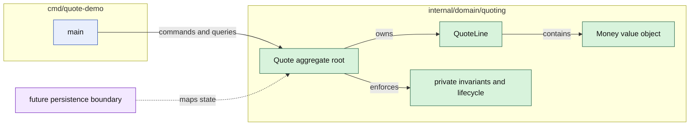

# Lesson 001: Rich Domain Model Skeleton

## Objective

Build the first runnable Rich Domain Model slice: a self-contained `Quote` aggregate that validates its own state, calculates its total, and owns its initial approval lifecycle without knowing how it will be stored.

## Theory

The aggregate root is the entry point for changing a quote. Its fields are private, so callers cannot bypass the rules by assigning a status or appending an invalid line directly.

The first domain rules are:

- a quote needs an identity and a customer identity
- a quote can receive lines only while it is `Draft`
- line quantities must be positive
- all lines in one quote use the same currency
- an empty quote cannot be submitted for approval
- only a quote waiting for approval can be approved or rejected

`Money` is a value object. It can only be created with a non-negative amount and a currency, and it refuses arithmetic across different currencies. `QuoteLine` is also constructed through a validating function and exposes behavior for calculating its own line total.

There is no database reference anywhere in the domain package. The CLI uses the aggregate directly in memory, but that is only a composition choice for the demo; the aggregate does not depend on memory, SQL, a document store, or an ORM.

## Why This Matters Here

The previous Active Record skeleton made the caller persist a model through `Quote.Save`, and the model carried the database connection needed for that operation. This lesson changes the dependency direction:

- the application creates a valid domain object
- the aggregate enforces changes through methods such as `AddLine` and `SubmitForApproval`
- the application asks the aggregate for results such as `Total` and `Status`
- a future repository or mapper can persist the aggregate without becoming part of its invariants

The model is intentionally small. The goal is to make the architectural seam visible before adding storage, application services, or other aggregates.

## Diagram

## Implementation Focus

Implement only:

- a standalone Go module for the Rich Domain Model track
- a private `Money` value object with safe currency arithmetic
- a private-state `Quote` aggregate and validating `QuoteLine`
- quote behavior for adding lines, totaling, submitting, approving, and rejecting
- tests for invariants, encapsulation, arithmetic, and lifecycle transitions
- a small CLI that composes and exercises the aggregate in memory

Deliberately leave repositories, database schemas, ORM mappings, ports, HTTP adapters, and cross-aggregate workflows for later lessons.

## What To Verify

- `go test ./...` passes from `rich-domain-model-architecture/`
- invalid identities, negative money, invalid quantities, and mixed currencies are rejected
- an empty quote cannot be submitted
- a submitted quote cannot be edited
- only a pending quote can be approved or rejected
- `go run ./cmd/quote-demo` demonstrates the domain lifecycle without opening a database connection
