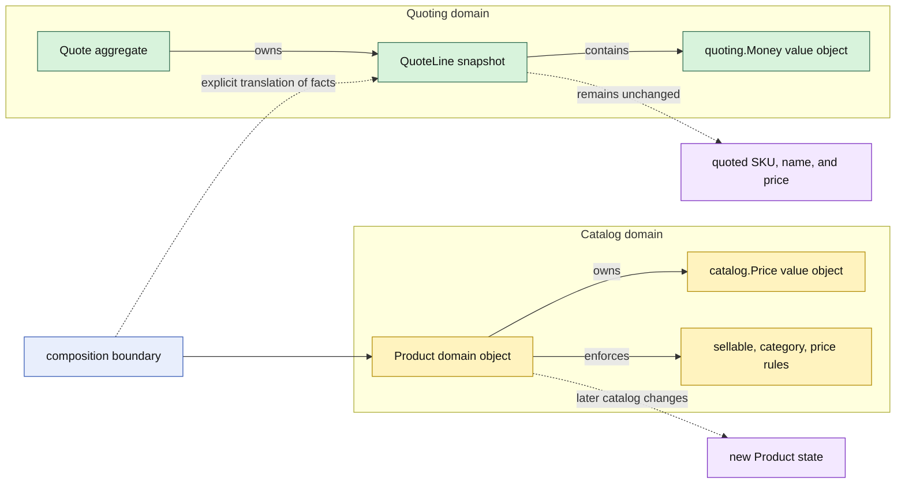

# Lesson 002: Product Domain Object And Quote Snapshot

## Objective

Add a rich `Product` domain object and translate its current catalog facts into a `QuoteLine` snapshot without sharing mutable product state with the quote.

## Theory

In a Rich Domain Model, `Product` is not a public record that the quote is allowed to inspect and retain. It owns catalog behavior such as:

- validating its SKU, name, category, and base price
- determining whether it is currently sellable
- changing its price
- becoming discontinued

When a quote line is created, Quoting takes the facts it needs at that moment. The line stores its own SKU, product-name snapshot, quantity, and unit price. It does not keep a pointer to `Product`, so a later catalog price change cannot silently rewrite an existing quote.

The translation is explicit at the composition boundary. `catalog.Price` and `quoting.Money` are separate value objects, and the caller maps one to the other before constructing the line. This keeps the two domain concepts expressive without making either one persistence-aware or dependent on the other package's aggregate.

## Why This Matters Here

Lesson 001 showed a behavior-rich `Quote`, but its caller still supplied a bare SKU and price. This lesson introduces a second domain object and makes two boundaries visible:

- Product protects its own catalog invariants
- Quote owns a commercial snapshot rather than a live Product reference

That separation prevents a common modeling mistake: making one aggregate a mutable data source for another aggregate. It also gives later pricing and catalog lessons a place to add behavior without turning `Quote` into a catalog manager.

## Diagram

Legend:

- yellow: Catalog domain ownership
- green: Quoting domain ownership
- blue: composition/translation boundary
- purple: state changes and snapshot result
- solid arrows: ownership or runtime composition
- dashed arrows: translation or independent later state

## Implementation Focus

Implement only:

- a private-state `Product` domain object in a Catalog package
- a `catalog.Price` value object and product lifecycle behavior
- a `QuoteLine` constructor that accepts a product-name snapshot
- explicit Product-to-QuoteLine translation in the CLI composition root
- tests proving product invariants and that changing Product does not change an existing quote line

Leave product persistence, repositories, pricing services, customer coordination, and cross-aggregate application workflows for later lessons.

## What To Verify

- `go test ./...` passes from `rich-domain-model-architecture/`
- invalid product data and non-sellable products are rejected
- Product price changes are made through domain behavior
- a quote line keeps its original product name and unit price after Product changes
- the quote depends on a value snapshot, not on a Product pointer or database connection
