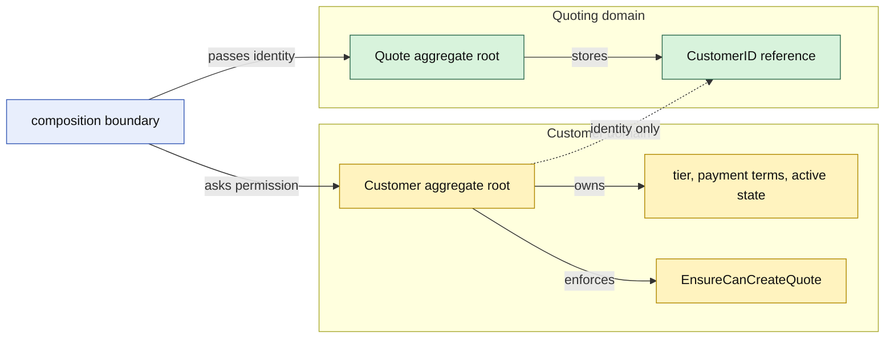

# Lesson 003: Customer Domain Object And Aggregate Reference

## Objective

Add a rich `Customer` domain object and show how a `Quote` refers to it by identity without embedding or mutating the Customer aggregate.

## Theory

`Customer` owns customer-specific language and behavior:

- customer identity
- tier and payment terms
- active or inactive lifecycle
- the rule that an inactive customer cannot create a new quote

`Quote` belongs to the Quoting domain and should not retain a `Customer` pointer. It stores only a `CustomerID` value. The composition boundary checks the Customer's behavior and then passes the identity into `NewQuote`.

This gives each aggregate a clear consistency boundary. Customer changes do not silently become Quote changes, and Quote methods do not become a back door into Customer state. The cost is explicit coordination: a caller must load or otherwise obtain both aggregates when a use case needs facts from both.

## Why This Matters Here

The Product lesson introduced a second domain object through a value snapshot. This lesson introduces a second aggregate with an identity reference instead of a copied object:

- Product facts needed for a quote are snapshotted into a `QuoteLine`
- Customer identity remains a reference because Customer has its own lifecycle
- Customer owns the active-customer rule
- the composition boundary coordinates the two aggregates without making either one depend on persistence

Rich Domain Model does not mean that every object should contain every related object. Richness comes from putting each rule on the object that owns the language and state required to enforce it.

## Diagram

Legend:

- yellow: Customer aggregate ownership and behavior
- green: Quote aggregate ownership and identity reference
- blue: composition/application boundary
- solid arrows: runtime coordination or ownership
- dashed arrow: identity relationship, not object ownership

## Implementation Focus

Implement only:

- a private-state `Customer` aggregate with tier and payment-term value classifications
- Customer lifecycle behavior for activation, deactivation, classification changes, and quote eligibility
- composition-root coordination that checks Customer before creating a Quote
- tests proving Customer invariants and that Quote stores only `CustomerID`

Leave customer persistence, repositories, customer query models, and a reusable application service for later lessons.

## What To Verify

- `go test ./...` passes from `rich-domain-model-architecture/`
- invalid customer identity, tier, and payment terms are rejected
- deactivated customers cannot create new quotes
- Customer lifecycle changes stay inside the Customer aggregate
- Quote keeps a CustomerID reference and does not depend on a Customer pointer or database connection
