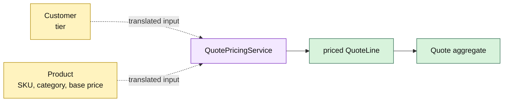

# Lesson 004: Quote Pricing Domain Service

## Objective

Introduce a stateless pricing domain service that combines Customer and Catalog facts to create a priced `QuoteLine`.

## Theory

Not every business rule belongs naturally to one aggregate. Quote pricing needs a Product's catalog price and category plus a Customer's tier. A `QuotePricingService` is a domain service because it owns business behavior without owning an aggregate lifecycle.

The service accepts translated, context-local inputs and returns a validated Quoting value. It does not load Customers, inspect database records, or mutate the Quote. The Quote aggregate still decides whether the resulting line can be added.

The first policy is deliberately small:

- Standard customers receive no discount
- Preferred customers receive 5% off
- Enterprise customers receive 10% off

The tradeoff is an additional domain object and an explicit translation boundary, but pricing no longer bloats Product, Customer, or Quote with facts owned elsewhere.

## Why This Matters Here

Rich Domain Model does not mean forcing every rule into an entity method. The service is the right home for a rule that spans two aggregates and produces a third context's value. Its stateless shape makes the calculation deterministic and easy to test.

## Diagram

Legend:

- yellow: facts owned by other domain objects
- purple: stateless cross-object domain behavior
- green: Quoting value and aggregate
- dashed arrows: explicit translation into service inputs
- solid arrows: pricing result and aggregate command

## Implementation Focus

Implement only:

- Quoting product-category vocabulary on the line snapshot
- Customer pricing tiers and a pricing-policy contract
- a stateless `QuotePricingService` with deterministic tier discounts
- tests and demo composition for Standard, Preferred, and Enterprise pricing

Leave approval policy, persistence, and application-service orchestration for later lessons.

## What To Verify

- `go test ./...` passes from `rich-domain-model-architecture/`
- each supported tier produces the expected unit price
- invalid tiers are rejected
- the service does not mutate Quote state
- Quote still owns acceptance of the priced line and its own invariants
