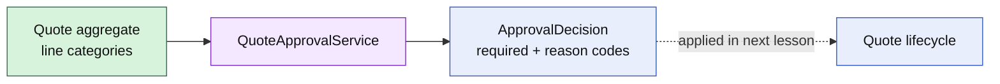

# Lesson 005: Quote Approval Domain Service

## Objective

Evaluate whether a Quote requires approval without placing cross-cutting approval policy inside Customer, Product, or Quote.

## Theory

Approval is a business decision derived from commercial facts. The first rule is that a `CustomBuild` line requires review. A stateless `QuoteApprovalService` inspects the Quote and returns an `ApprovalDecision` with stable reason codes.

The service is deliberately side-effect free. It does not change Quote status, approve a manager decision, or persist a result. A later lesson will let the aggregate apply the decision to its lifecycle.

This keeps three concerns distinct:

- Quote owns editing, totals, and legal state transitions
- the approval service evaluates policy
- an application workflow can coordinate the decision with people or other systems later

## Why This Matters Here

Rich domain behavior should be placed where the required business facts are available, not automatically on the nearest entity. Approval may grow to include discount thresholds, customer risk, and configurable policies. Keeping it as a domain service avoids turning Quote into a policy engine.

## Diagram

## Implementation Focus

Implement only:

- approval reason and decision types in the Quoting domain
- a stateless `QuoteApprovalService`
- the CustomBuild approval rule
- tests proving evaluation is deterministic and does not mutate Quote
- a small demo output for the decision

Leave approval state transitions, manager actors, and persistence for later lessons.

## What To Verify

- `go test ./...` passes
- standard quotes do not require approval
- CustomBuild quotes return a deterministic reason
- evaluating approval leaves Quote status and lines unchanged
