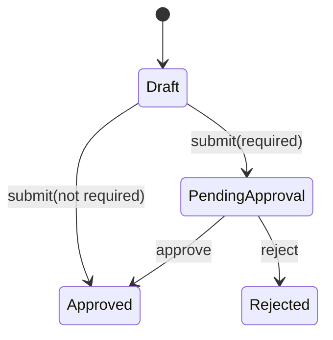

# Lesson 006: Quote Approval Lifecycle

## Objective

Let the `Quote` aggregate apply an approval decision to its own lifecycle while keeping policy evaluation separate.

## Theory

Lesson 005 answered whether review is required. This lesson applies that decision inside the aggregate:

- a Draft quote with a required decision becomes `PendingApproval`
- a Draft quote without a required decision becomes `Approved`
- only a PendingApproval quote can be approved or rejected

The aggregate receives a value decision; it does not call the approval service itself. That keeps the state transition explicit and prevents a policy calculation from silently performing workflow actions.

## Why This Matters Here

The rich model now has a clear separation between decision and transition. External code cannot assign Quote status directly. It must issue a domain command that validates the current state and applies the legal transition.

## Diagram

## Implementation Focus

Implement only:

- approval-aware Quote submission
- guarded `Approve` and `Reject` transitions
- tests for automatic approval, pending review, and illegal transitions
- demo composition that evaluates policy before applying the lifecycle command

Leave manager identity, approval persistence, and application workflow coordination for later lessons.

## What To Verify

- `go test ./...` passes
- a Standard quote becomes Approved when approval is not required
- a CustomBuild quote becomes PendingApproval
- only PendingApproval quotes can be approved or rejected
- the approval service still evaluates policy without mutating Quote
