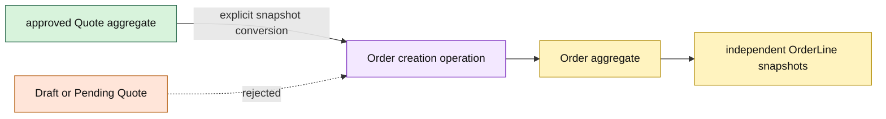

# Lesson 007: Order Aggregate From An Approved Quote

## Objective

Introduce the `Order` aggregate and convert an approved Quote into an independent committed commercial snapshot.

## Theory

Quote and Order are different business concepts. A Quote is negotiable; an Order is committed. The conversion boundary therefore validates that the Quote is `Approved`, then copies its customer, source quote, and line facts into a new Order.

The Order does not retain a live pointer to Quote. Its own aggregate state and line values remain stable if a caller later changes the original Quote. This is another explicit boundary between rich domain objects, not a convenience object graph.

## Why This Matters Here

Rich Domain Model keeps each aggregate responsible for its own language and lifecycle. The conversion operation needs facts from Quote, but the resulting Order owns its own invariants and future state transitions. The cost is an explicit translation operation; the benefit is that committed commercial facts are not coupled to a negotiable object.

## Diagram

## Implementation Focus

Implement only:

- an Ordering `Money` value object
- an `Order` aggregate with private state and `PendingPayment` status
- guarded creation from an approved Quote
- independent order-line snapshots and total calculation
- tests for rejected and successful conversion
- demo output for the created Order

Leave payment, inventory, shipment, and cancellation behavior for later lessons.

## What To Verify

- `go test ./...` passes
- Draft and PendingApproval quotes cannot become Orders
- an approved Quote creates a PendingPayment Order
- Order totals and line facts are copied values
- Order does not retain a Quote pointer or persistence dependency
