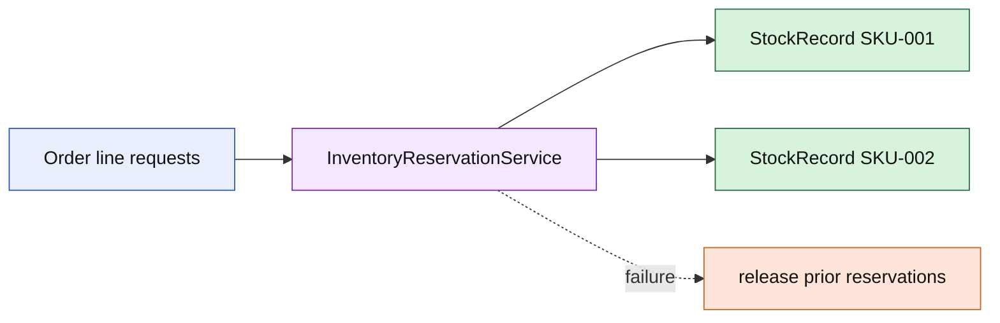

# Lesson 008: Inventory Reservation Domain Service

## Objective

Coordinate reservations across StockRecord aggregates while preserving each aggregate's local quantity invariants.

## Theory

An Order can contain several SKUs, while each `StockRecord` owns only one SKU's on-hand and reserved quantities. A stateless `InventoryReservationService` coordinates those aggregates as one business operation.

If a later request cannot be satisfied, the service releases earlier reservations. The service coordinates the transaction-like behavior, but it does not become the owner of stock. `StockRecord` still decides whether a single reserve or release is legal.

## Why This Matters Here

This is a domain-service case: the rule spans multiple aggregates and cannot naturally belong to one of them. Keeping the coordinator outside `StockRecord` prevents one stock aggregate from becoming a god object for the whole inventory collection.

The tradeoff is explicit rollback code and a caller-provided collection of aggregates. That is preferable here because it keeps ownership and invariants visible.

## Diagram

## Implementation Focus

Implement only:

- a `StockRecord` aggregate for one SKU
- receive, reserve, release, availability, and low-stock behavior
- reservation request/result vocabulary
- an `InventoryReservationService` with rollback on failure
- tests for successful multi-record reservations and rollback
- demo composition for the current Order's requested quantity

Leave persistence, backorder policy, and cancellation coordination for later lessons.

## What To Verify

- `go test ./...` passes
- multiple stock records reserve successfully
- a failed later reservation rolls back earlier reservations
- invalid quantities and insufficient availability are rejected
- StockRecord remains the owner of per-SKU quantity rules
