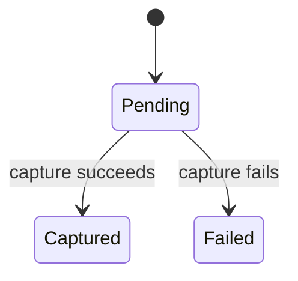
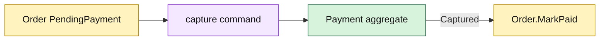

# Lesson 009: Payment Capture Aggregate

## Objective

Model Payment as a separate aggregate and connect successful capture to the Order's paid state.

## Theory

Payment has its own identity, amount, and lifecycle. A Payment starts `Pending` and can become `Captured` or `Failed`. It should not be folded into the Order aggregate.

The consistency rule is explicit at the coordination boundary: Order becomes `Paid` only after Payment has successfully been captured. Payment owns payment status; Order owns order status. Neither aggregate reaches into the other's private state.

## Why This Matters Here

Keeping financial state separate prevents Order from becoming responsible for every commercial and operational concern. It also gives a later gateway adapter or payment-review workflow a stable aggregate to collaborate with.

The tradeoff is that a caller must coordinate two state transitions and handle partial failure. That explicit coordination is the useful architectural signal.

## Diagram

## Implementation Focus

Implement only:

- a Payments `Money` value object
- Payment identity, amount, and Pending/Captured/Failed lifecycle
- Order's guarded Paid transition
- tests for successful, repeated, and invalid capture paths
- demo coordination for a successful payment

Leave external payment gateways and payment-review workflows for later lessons.

## What To Verify

- `go test ./...` passes
- pending payments can be captured once
- repeated or failed captures are rejected
- an Order cannot be marked Paid from the wrong state
- Payment and Order remain separate rich aggregates
