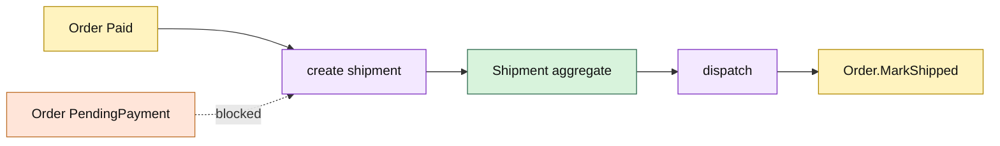

# Lesson 010: Shipment Aggregate After Payment

## Objective

Model Shipment as a separate Fulfillment aggregate and require payment before shipment creation.

## Theory

Shipment is a physical fulfillment record, not merely another Order flag. It owns shipment lines and its own Pending/Dispatched lifecycle. Order remains the commercial aggregate and records that fulfillment has started only after Shipment is dispatched.

The creation rule is explicit: a PendingPayment Order cannot create a Shipment. Payment and Shipment collaborate through guarded operations rather than one aggregate reaching into the other's internals.

## Why This Matters Here

Rich Domain Model keeps distinct business lifecycles in distinct objects. If Shipment were just a field on Order, warehouse-specific behavior would gradually make the commercial aggregate responsible for physical fulfillment as well.

The cost is a multi-aggregate workflow and explicit sequencing. The benefit is that shipment rules can grow independently and be tested without constructing the entire commerce model.

## Diagram

## Implementation Focus

Implement only:

- Fulfillment Shipment identity, line snapshots, and dispatch lifecycle
- creation from a Paid Order
- Order's guarded Shipped transition
- tests for unpaid rejection and successful dispatch
- demo payment → shipment → shipped-order flow

Leave partial shipment quantities for a later lesson.

## What To Verify

- `go test ./...` passes
- unpaid Orders cannot create Shipments
- paid Orders create pending Shipments
- dispatch changes Shipment and Order state correctly
- Shipment remains a separate aggregate from Order
