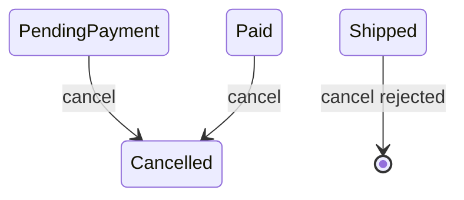
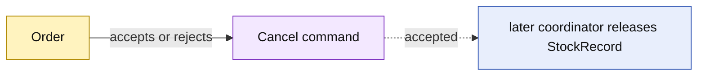

# Lesson 011: Order Cancellation And Reservation Release

## Objective

Add the Order cancellation invariant and make the release responsibility explicit at the coordination boundary.

## Theory

An Order may be cancelled before shipment, but a shipped Order must use the Returns workflow instead. The Order aggregate owns that lifecycle decision.

Inventory reservations belong to StockRecord aggregates, so Order cancellation must not secretly mutate stock from inside Order. A later application workflow can call Inventory release after the Order accepts cancellation.

## Why This Matters Here

Rich Domain Model keeps aggregate responsibilities narrow. Order decides whether cancellation is legal; Inventory decides whether a reservation can be released. This prevents a convenience method from turning Order into a gateway to unrelated aggregate state.

## Diagram

## Implementation Focus

Implement only:

- `Cancelled` Order status
- guarded `Cancel` behavior
- tests for cancellable and shipped orders
- demo output showing cancellation rejection after shipment

Leave the full cancellation workflow and inventory release coordination for later lessons.

## What To Verify

- `go test ./...` passes
- PendingPayment and Paid Orders can be cancelled
- Shipped Orders cannot be cancelled
- Order cancellation does not directly mutate StockRecord
