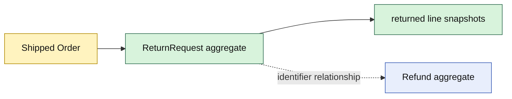

# Lesson 012: ReturnRequest And Refund Aggregates

## Objective

Introduce Returns as its own domain with separate return-request and refund lifecycles.

## Theory

A `ReturnRequest` records customer intent and the shipped lines being returned. A `Refund` records the financial follow-up. They are related, but they have different lifecycles and consistency rules, so they remain separate aggregates linked by identifiers.

The first rule is simple: a return can be created only from a Shipped Order. The returned line facts are copied into the request so later Order state changes cannot rewrite the customer's request.

## Why This Matters Here

Rich Domain Model avoids collapsing operational and financial workflows into the Order aggregate. Returns can later gain eligibility, review, actor, restocking, and idempotency behavior without making Order responsible for every concern.

## Diagram

## Implementation Focus

Implement only:

- ReturnRequest creation from a Shipped Order
- return line snapshots and requested status
- Refund Pending/Issued lifecycle
- independent IDs between request and refund
- tests for shipped-order guards and one-time refund issuance
- demo output for a requested return and issued refund

Leave return eligibility, review, actors, and restocking for later lessons.

## What To Verify

- `go test ./...` passes
- unshipped Orders cannot create ReturnRequests
- shipped line snapshots are copied into the request
- Refund can be issued only once
- ReturnRequest and Refund remain separate rich aggregates
