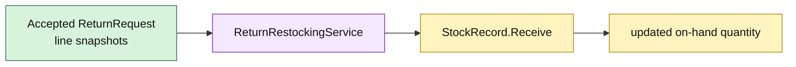

# Lesson 013: Return Restocking Domain Service

## Objective

Restock accepted return lines through Inventory without making Returns own stock state.

## Theory

Returns knows which lines were accepted, while Inventory owns on-hand quantities. A `ReturnRestockingService` translates accepted return facts into `StockRecord.Receive` operations.

The service coordinates contexts but does not reach into StockRecord fields. StockRecord remains responsible for quantity validation, and the service remains stateless.

## Why This Matters Here

Rich Domain Model keeps ownership clear even when a workflow crosses domains. Returns does not become an inventory record, and Inventory does not need to know whether received goods came from a return, a supplier, or a correction.

The tradeoff is a small translation service and an explicit accepted-return precondition. That indirection preserves the domain boundaries.

## Diagram

## Implementation Focus

Implement only:

- restock request vocabulary
- a `ReturnRestockingService` that calls StockRecord behavior
- tests for successful and invalid restocking
- demo accepted-return → restock flow

Leave partial returns, restock auditing, and command idempotency for later lessons.

## What To Verify

- `go test ./...` passes
- accepted return quantities increase on-hand stock
- unknown SKUs and invalid quantities are rejected
- restocking does not alter reserved quantity
- Returns and Inventory remain separate rich domains
