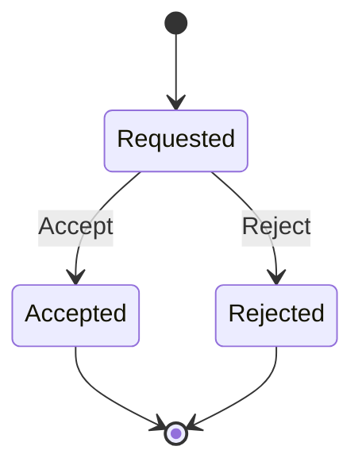

# Lesson 014: Return Review Boundary

## Objective

Make return review an explicit domain decision instead of exposing status mutation to callers.

## Theory

A ReturnRequest begins as customer intent. Review is a separate business moment that produces an accepted or rejected outcome. The aggregate receives a review decision, validates that the request is still reviewable, and applies the transition.

The public `Accept` and `Reject` commands are meaningful domain language. They delegate to one guarded review boundary, so invalid or repeated decisions cannot bypass the aggregate lifecycle.

## Why This Matters Here

Rich Domain Model makes important business moments explicit. A review boundary gives later eligibility, actor, and idempotency concerns a stable place without spreading status assignments across callers.

## Diagram

## Implementation Focus

Implement only:

- explicit `Accept` and `Reject` domain commands
- one guarded review boundary on ReturnRequest
- tests for accepted, rejected, invalid, and repeated decisions
- demo use of the explicit accepted transition

Leave eligibility policy, reviewer metadata, and command idempotency for later lessons.

## What To Verify

- `go test ./...` passes
- requested returns can be accepted or rejected
- reviewed returns cannot be reviewed again
- invalid decisions are rejected
- review decisions do not issue refunds automatically
