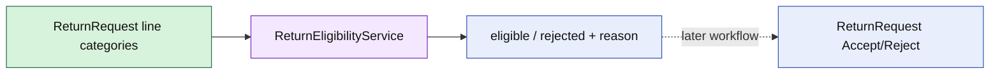

# Lesson 015: Return Eligibility Domain Service

## Objective

Introduce a return-policy domain service that evaluates whether returned product categories are eligible.

## Theory

Return review and return eligibility are different decisions. `ReturnEligibilityService` evaluates policy facts and returns an outcome; it does not mutate ReturnRequest state or issue refunds.

The first policy is canonical: Clearance products cannot be returned. Standard and CustomBuild lines remain eligible at this policy stage.

## Why This Matters Here

Policy logic belongs in an explicit domain service when it does not own ReturnRequest's intent or lifecycle. That keeps the aggregate focused while allowing return rules to grow independently and remain easy to test.

## Diagram

## Implementation Focus

Implement only:

- eligibility input and decision types
- the Clearance exclusion rule
- side-effect-free eligibility evaluation
- tests for eligible and rejected categories
- demo output for the current return request's policy decision

Leave shipment-time windows and review integration for later lessons.

## What To Verify

- `go test ./...` passes
- Standard and CustomBuild lines are eligible
- Clearance lines are rejected with a stable reason
- evaluating eligibility does not mutate ReturnRequest
