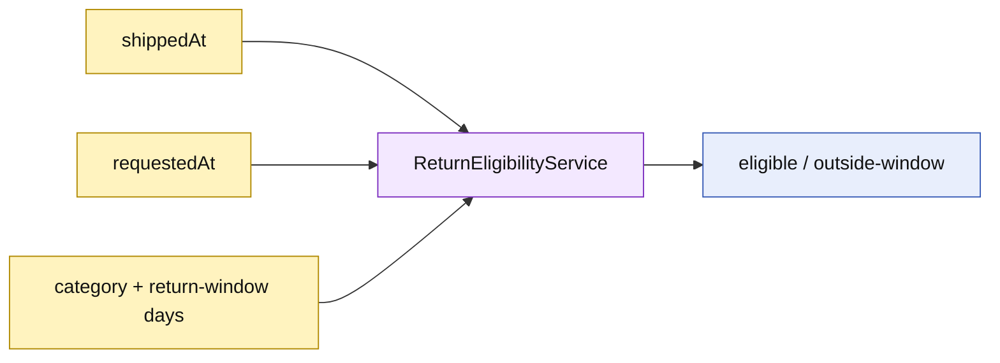

# Lesson 016: Real Return Window Policy

## Objective

Add time-based return eligibility without moving date calculations into ReturnRequest.

## Theory

Return eligibility depends on both product policy and elapsed time. Each eligibility line carries a return window in days. A request is eligible only when its date is on or before the shipment date plus every line's allowed window.

The policy remains a pure domain decision: it reads timestamps and line facts, then returns an outcome. Product category rules are evaluated first, so a Clearance line remains ineligible regardless of dates.

## Why This Matters Here

Temporal business rules are easy to get wrong when hidden in controllers or aggregate mutation. Keeping the date arithmetic in a stateless service makes the boundary explicit and tests can use fixed timestamps instead of the system clock.

## Diagram

## Implementation Focus

Implement only:

- Product return-window data with a safe default and validation
- `EvaluateWindow` date arithmetic in ReturnEligibilityService
- tests for inside-window, expired, invalid-window, and Clearance cases
- demo evaluation with fixed shipment and request timestamps

Leave clock ownership and policy persistence for later lessons.

## What To Verify

- `go test ./...` passes
- requests inside the window are eligible
- requests after the window are rejected
- invalid windows are rejected
- Clearance remains rejected regardless of date
