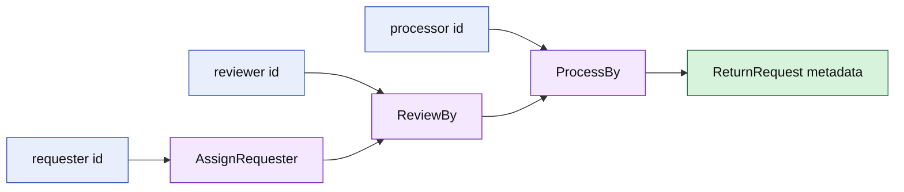

# Lesson 017: Return Actor Metadata

## Objective

Record who requested, reviewed, and processed a return inside the ReturnRequest aggregate.

## Theory

Actor identity is a business fact when the workflow needs accountability. The aggregate stores the identity together with the state-changing command, while authentication, authorization, and user lookup remain outside the domain.

The workflow now distinguishes three moments:

- the requester creates or submits the return intent
- the reviewer accepts or rejects it
- the processor performs the accepted follow-up

## Why This Matters Here

Without actor metadata, a return can be accepted or processed but the domain cannot explain who performed those actions. Explicit fields make accountability part of the model instead of an accidental log detail.

## Diagram

## Implementation Focus

Implement only:

- non-empty actor validation
- requester, reviewer, and processor metadata methods
- state guards for review and processing
- tests for successful metadata and invalid actor/state paths
- demo use of the accountable return workflow

Keep authentication and authorization outside the aggregate.

## What To Verify

- `go test ./...` passes
- actor metadata is available after each workflow step
- empty actors are rejected
- processing a non-accepted return is rejected
- the aggregate records facts without performing identity lookup
