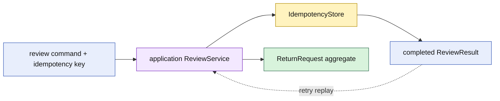

# Lesson 018: Return Command Idempotency

## Objective

Make return review commands safe to retry after a timeout or duplicate submission.

## Theory

Idempotency is an application concern. The application remembers a completed command and returns the same result on a retry. The ReturnRequest aggregate still owns the review and processing transitions; it does not need to know how commands are stored or transported.

The application service follows this order:

1. require a caller-supplied idempotency key
2. return the stored result when the key was already completed
3. invoke the aggregate once
4. store and return the result

## Why This Matters Here

Retries are common at system boundaries. Recording the completed result outside the aggregate prevents a second request from repeating domain work while keeping the rich model focused on return rules.

The in-memory store is only a verifiable stand-in for a durable implementation. The architectural boundary is the application contract, not the chosen storage.

## Diagram

## Implementation Focus

Implement only:

- an application-level `IdempotencyStore` contract
- an in-memory implementation for tests and demo
- `ReviewService` that stores successful review results by key
- tests proving same-key replay and missing-key rejection
- demo use of the application service

Leave durable persistence, distributed locking, and transport concerns for later architecture tracks.

## What To Verify

- `go test ./...` passes
- the second review with the same key returns the first result
- the aggregate is not reviewed twice
- review commands without a key are rejected
- idempotency remains outside the ReturnRequest aggregate
