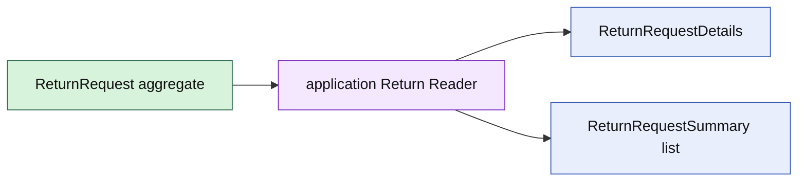

# Lesson 019: Return Query Surface

## Objective

Expose ReturnRequest details and summaries through an application query surface without adding read concerns to the aggregate.

## Theory

Rich domain objects are optimized for business commands and invariants. A query often needs a flattened view: status strings, actor metadata, and line summaries. That read shape does not belong inside ReturnRequest.

The application query surface projects aggregate state into immutable details and summary types. The example uses an in-memory reader so the boundary is executable without introducing persistence into the domain.

## Why This Matters Here

Separating reads keeps the aggregate model focused and lets query consumers evolve independently. The tradeoff is a second set of read types and an explicit projection step, but it avoids turning the aggregate into a reporting DTO.

## Diagram

## Implementation Focus

Implement only:

- ReturnRequest detail and summary read types
- an application `Reader` contract
- an in-memory projection with filtering and deterministic ordering
- tests for save, get, list, and not-found behavior
- demo query output

Leave database query adapters and pagination for later architecture work.

## What To Verify

- `go test ./...` passes
- saved ReturnRequests can be queried without exposing domain slices
- status filtering works
- missing requests return a query-specific error
- query types remain separate from ReturnRequest commands
