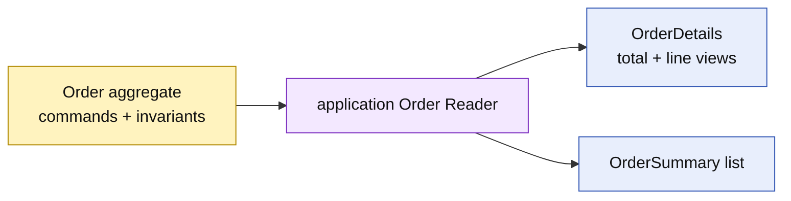

# Lesson 020: Order Query Surface

## Objective

Expose Order details and summaries through an application query surface while keeping Order focused on commands and invariants.

## Theory

Order's rich behavior is optimized for transitions such as payment, shipment, and cancellation. Query consumers need a stable projection of commercial totals, source IDs, status, and line summaries.

The application reader builds those views from the aggregate. It does not add query-specific methods to Order or expose its private line collection.

## Why This Matters Here

The command model and read model have different pressures. A query surface prevents reporting fields and sorting/filtering concerns from leaking into the Order aggregate, while preserving an explicit projection boundary.

## Diagram

## Implementation Focus

Implement only:

- Order detail and summary read types
- an application `Reader` contract
- an in-memory projection with status filtering and sorted results
- tests for totals, copied lines, and not-found behavior
- demo query output

Leave database-specific queries, pagination, and search indexes for later work.

## What To Verify

- `go test ./...` passes
- Order details contain source quote, customer, status, total, and line views
- returned line slices are copies
- status filtering and not-found errors work
- the query surface does not mutate Order
