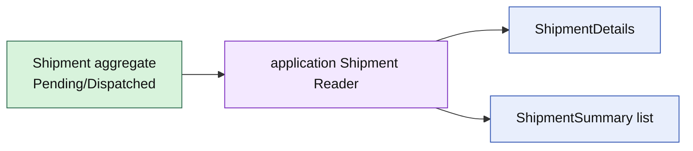

# Lesson 021: Shipment Query Surface

## Objective

Expose Shipment details and summaries through an application query surface without putting read concerns on the Fulfillment aggregate.

## Theory

Shipment commands protect dispatch state and line invariants. Operational screens usually need a projection keyed by shipment ID: order reference, dispatch status, and line counts.

The query reader translates the rich aggregate into details and summaries. It can later be replaced with a database-backed reader without changing Shipment behavior.

## Why This Matters Here

Fulfillment queries have different shape and sorting needs from Order commands. Keeping the read model outside Shipment avoids a growing aggregate API designed for screens rather than business transitions.

## Diagram

## Implementation Focus

Implement only:

- Shipment detail and summary read types
- an application `Reader` contract
- an in-memory projection with status filtering and copied line views
- tests for save, get, list, and missing shipments
- demo query output

Leave database adapters and fulfillment search concerns for later work.

## What To Verify

- `go test ./...` passes
- Shipment details contain order, status, and lines
- list filtering and deterministic ordering work
- missing shipments return a query-specific error
- the Shipment aggregate remains command-focused
