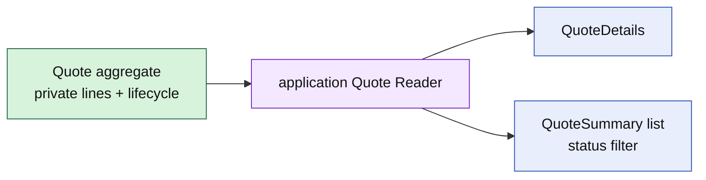

# Lesson 022: Quote List Query Surface

## Objective

Expose Quote details and status-filtered summaries through an application read surface.

## Theory

Quote commands protect commercial invariants, but list screens need a compact projection of IDs, customer references, status, totals, and line counts. That projection should not become another responsibility of the Quote aggregate.

The query surface stores read details and returns deterministic summaries. It is intentionally separate from the domain command API.

## Why This Matters Here

Rich aggregates should not grow ad hoc list methods for every consumer. A query reader gives the application a place to add filtering and ordering while keeping Quote's public API expressed in business commands and meaningful values.

## Diagram

## Implementation Focus

Implement only:

- Quote detail and summary view types
- an application `Reader` contract
- an in-memory projection with status filtering and sorted results
- tests for total projection and not-found behavior
- demo query output

Leave pagination, full-text search, and database read adapters for later work.

## What To Verify

- `go test ./...` passes
- Quote details include customer, status, total, and line count
- status filters return only matching quotes
- missing quotes return a query-specific error
- the query reader does not change Quote lifecycle state
