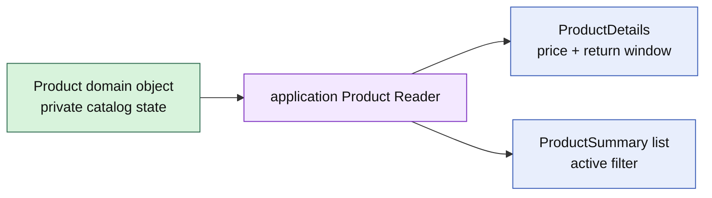

# Lesson 023: Product Query Surface

## Objective

Expose catalog Product details and summaries through an application read surface without turning Product into a query DTO.

## Theory

Product protects catalog rules such as category, price, availability, and return window. Catalog screens often need a flattened representation and an active/inactive filter.

The query surface projects Product state into read types. It does not expose private fields or add screen-specific behavior to the rich Product object.

## Why This Matters Here

The domain object remains optimized for catalog commands and invariants, while the application read model can evolve for browsing and operations. This separation is especially useful when a future query adapter uses a different storage shape.

## Diagram

## Implementation Focus

Implement only:

- Product detail and summary view types
- an application `Reader` contract
- an in-memory projection with optional active filtering
- tests for price and lifecycle projection
- demo query output

Leave catalog search, pagination, and persistence adapters for later work.

## What To Verify

- `go test ./...` passes
- Product details include category, price, currency, return window, and active state
- active filtering works
- missing products return a query-specific error
- query reads do not mutate Product
